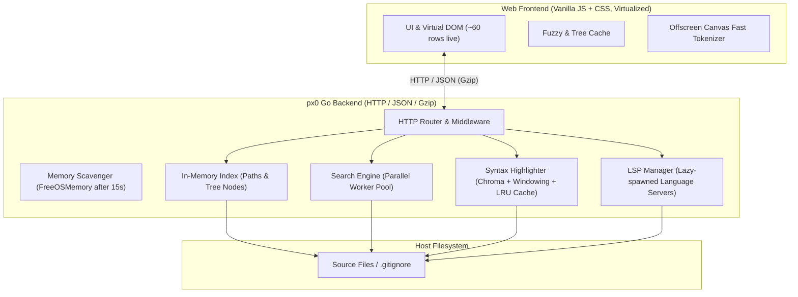

# Architecture and Performance Optimizations of px0

This document outlines the high-level architecture and key performance optimizations implemented in px0, explaining how it delivers instant navigation, sub-millisecond queries, and a minimal memory footprint across codebases spanning tens of thousands of files.

## High-Level Architecture

px0 is structured as an ultra-lightweight, zero-config, read-only code reader and navigator packaged as a single statically linked binary (~9.5 MB).

### Core Components

1. Single Binary Distribution (`main.go`): Embeds the web UI (HTML, CSS, JS ~74 KB) via `go:embed`. Runs with no runtime dependencies, no CGO, no node_modules.
2. In-Memory Path Index (`index.go`): Collects and maintains file paths, directory trees, and basenames in compact structures for instant path resolution and fuzzy lookups.
3. Optimized Ignore Engine (`ignore.go`): Fast multi-level `.gitignore` evaluator using classification-based matching without regex backtracking where possible.
4. Windowed Syntax Highlighting Engine (`highlight.go`): Slotted file reader and Chroma tokenizer that works on viewport windows rather than entire multi-megabyte files.
5. Parallel Search Engine (`search.go`): Multi-core worker pool utilizing custom buffer reuse, SIMD/Boyer-Moore-backed literal search, and line-level fast elision.
6. Lazy LSP Manager (`lsp.go`, `lspnav.go`, `lspservers.go`, `lspsetup.go`, `calls.go`): Dynamic lifecycle controller that spawns language servers only upon first request for that language, automatically falling back to regex definitions when LSP is inactive. Discovery looks on `PATH` and in common install folders (`~/go/bin`, `~/.cargo/bin`, `~/.local/bin`, npm's global bin, Homebrew's llvm) and can run again at any time. When a file type has no server, `lspsetup.go` reports the registry's install recipes for the current OS, runs a user-level one in the background on request, then rescans and starts the server. The install and start endpoints accept only a POST whose `Origin` matches its `Host`, and only when that host is an IP address or `localhost`, so neither another site nor a DNS-rebinding domain can trigger an install; the command itself always comes from the registry, never from the request.
7. DOM Virtualization Frontend (`web/app.js`): Custom ~60-row DOM virtualization with offscreen canvas text measuring and `requestAnimationFrame` render throttling.
8. Markdown Preview (`markdown.go`, `web/src/markdown.js`): Renders `.md` and `.markdown` files with goldmark for a preview that opens by default and switches to the source with the Preview / Source control in the tab bar or Alt+M. See Markdown Preview below.

## Key Performance Optimizations

### Indexing and Filesystem Walking

- Bounded Parallel Directory Walk: Uses a channel-based semaphore (`runtime.NumCPU() * 4`) to bound goroutines during tree walking. When the worker pool saturates, recursive walking falls back to inline execution on the caller goroutine to prevent memory inflation and scheduler overhead.
- Ignored Entries Listed, Never Walked: A path matched by `.gitignore` (or the built-in defaults such as `node_modules/`) is added to its parent's tree listing with `ignored: true`, so the explorer shows it dimmed, but it is never descended into and never enters the flat file list, so search and fuzzy find skip it. Expanding an ignored directory reads that one directory from disk on demand (`Index.Children`), marking everything beneath it ignored, which matches git: nothing under an excluded directory can be re-included. Crafted paths with `.`/`..` segments are refused before any disk read. Version control internals (`.git`, `.hg`, `.svn`) are not listed at all. Find-in-file on an open ignored file still works: a literal search glob naming a file that exists but is not indexed is searched directly.
- Symlink Cycle Immunity: Rejects directory symlinks entirely (`e.Type()&os.ModeSymlink != 0`) to eliminate infinite recursive loop risks and stat penalties.
- Rule Specialization in Ignore Engine: Rather than evaluating complex regexes for every path, rules are classified into fast branches (`rkSegEq` for direct segment checks, `rkSegSuffix` for suffix checks like `*.pyc`, `rkPathEq` for exact path prefixes). For rules needing regex, a literal `prefix` test and a substring `must` check filter out ~99% of paths before invoking Go regex engine.
- Precomputed Lowercase and Basename Offsets: `FileEntry` precomputes `lower` and `nameStart` on insertion. Fuzzy searches run directly against pre-allocated lowercase slices without runtime allocations.
- Non-Blocking Asynchronous Startup Pipeline: The HTTP listener binds and starts serving traffic immediately (<1ms) rather than waiting for directory walking or language server discovery. The root directory tree (`dir=""`) is extracted and made available to `/api/tree` in sub-millisecond time. Full tree walking and indexing run concurrently in a background goroutine. Browser launch (`openBrowser`) executes immediately in parallel. Language server discovery (`exec.LookPath`) executes concurrently in the background.

### Viewport-Based Windowed Highlighting

- Chunk plus Context Highlighting: Chroma lexers run under 1 MB/s; tokenizing a 100,000-line file upfront introduces multi-second stalls. px0 lexes in bounded windows (`hlChunk = 1000` lines) padded with throwaway context (`hlContext = 400` lines). The leading context puts the lexer in the proper lexical state; trailing context ensures tokens are properly terminated.
- Byte-Capped Windows (`hlWindowBytes = 512 KB`): In files with very long lines (such as minified JS/JSON), 1,000 lines could equal tens of megabytes. If the window byte cap is exceeded, context is dropped, preventing lexer stalls.
- Dual-Tier Processing with Background Exact Pass: For files under `bgLimit = 2 MB`, after serving the initial viewport chunk instantly, a background goroutine finishes exact tokenization and transitions subsequent chunks to instant map lookups.
- LRU Highlight Memory Budget (`cacheBudget = 512 MB`): Highlight caches track the byte size of generated HTML strings and evict using an LRU linked list (`container/list`) when reaching the 512 MB threshold.
- Short Class Token Mapping: Token types are mapped to compact 1-2 character CSS classes (`c` for comment, `k` for keyword, `s` for string), shrinking payload sizes over the wire.

### Search Engine

- Whole-File Reject Fast Path: Searches perform an initial `bytes.Contains(data, literal)` check across the entire file before doing newline splitting, regex processing, or line-by-line scanning.
- Worker Buffer Reuse: File reads do not allocate per file. Each worker in the search pool holds a reusable `workBuf` containing a reusable read buffer (`readInto`) and an in-place ASCII lowercase buffer (`asciiLower`) to avoid UTF-8 fold allocations during case-insensitive literal searches.
- Smart Snippet Elision: Snippets truncate leading whitespace and elide text further than 32 runes away (`snipLead`), reporting compact `pre`, `mid`, and `post` slices directly to the client.
- Early Terminating Def Scanner: Pre-compiled regex patterns identify definition patterns per file extension concurrently during normal search passes, returning definition flags (`Match.Def`) without separate passes.

### Fuzzy Matching

- Two-Pass Bounded Search: Pass 1 confirms all query runes exist in order and marks the end boundary index. Pass 2 scans backward from the end boundary to find the tightest possible cluster of matches. This matches the ranking accuracy of dynamic programming algorithms ($O(N \times M)$) while maintaining an $O(N)$ linear scan time.
- Weighted Scoring Matrix: Awards heavy bonuses for consecutive characters (+12), word/boundary beginnings (`/`, `_`, `-`, `.`) (+16), camelCase transitions (+14), and hits inside the file basename (+14), while penalizing non-consecutive gaps.
- Parallel Chunk Slicing: For indices with over 4,000 files, queries are partitioned across CPU cores using a worker pool, followed by merging the top results via an in-place sort.

### Memory Management and Scavenging

- Proactive OS Memory Release: A background goroutine (`scavenge`) monitors server request activity (`s.lastReq`). If the server remains idle for more than 15 seconds after a heavy operation, it triggers `debug.FreeOSMemory()`, returning unused memory pages from the Go runtime back to the host operating system.
- Gzip Buffer Pooling: `gzip.Writer` instances are pooled via `sync.Pool` with `gzip.BestSpeed` compression level, reducing memory allocations on repetitive JSON responses.

### Frontend DOM Virtualization

- Fixed DOM Row Footprint (~60 Elements): The browser never instantiates DOM elements for thousands of lines. Only the visible viewport plus overscan (`OVERSCAN = 24` rows) are mounted in the DOM. Scrolling updates a single CSS `transform: translateY(...)` container, recycling rows dynamically.
- Offscreen Font Measurement: Uses an offscreen element (`#measure`) to calculate character widths (`S.chW`) down to fractional sub-pixels, ensuring scrollbar thumb dimensions and gutter widths are accurate without querying layout geometry on every paint.
- Throttling via `requestAnimationFrame`: Scroll events schedule paint operations strictly inside `requestAnimationFrame`, preventing scroll hitching and duplicate layout reflows.
- Localized DOM Decorations: Match highlights, bracket markers, and occurrences are applied only to active rows, ensuring highlighting stays within a sub-millisecond frame budget.
- Overlay Caret: The read-only caret is a single element in `#sizer`, not a node inside the code rows. After each paint (and directly on click, without a repaint that would break a drag-selection) `placeCaret()` measures a collapsed DOM Range at the line/column and translates the caret there. Keeping it out of the rows leaves their text nodes untouched for selection restore and word lookup.
- Selection Preservation: Every paint replaces the rows' markup, which would drop the browser's text selection (pressing Ctrl for link underlines, a double-click, or a background highlight refresh all repaint). `paint()` saves the selection as line/column positions before rewriting rows and restores it afterwards, so native copy (Ctrl/Cmd+C) keeps working. A selection whose endpoints scroll outside the rendered window is not restored.
- Whole-File Selection: Ctrl/Cmd+A outside a text field never uses the browser's select-all, which would take the sidebar and status bar and, with virtualized rows, only the rendered part of the file. `selectAll()` sets `S.selAll` to the active doc instead; `paint()` shades the code of every rendered row, the file's text is fetched once from `/api/raw` for Ctrl/Cmd+C and the status bar actions, and a click, Esc or tab change clears it.

### Markdown Preview

- Stateless Server Render: `/api/markdown` converts the whole file on each request with goldmark (GitHub Flavored Markdown tables, task lists, strikethrough and autolinks, plus footnotes) and caches nothing. Files over 4 MB (`maxMarkdownBytes`) are refused and the tab falls back to its source view.
- One Highlighter: Fenced code goes through the code view's Chroma lexers and `classFor` token classes (`highlightLines`), so a theme colours both. Unlabelled fences and fences over 256 KB (`maxFenceBytes`) stay plain, because guessing a language from content is slow and often wrong.
- Source Line Anchors: An AST transformer (`lineMarker`) writes `data-line` on headings, paragraphs, lists, list items, blockquotes, code blocks and tables. Line-based navigation (outline, go to line, search hits, history, `openFile` with a line) lands on the block holding that line, and switching between preview and source keeps the reader at the same block. Heading ids follow GitHub's rules (`headingIDs`), so tables of contents written for GitHub work.
- Sanitised in the Browser: goldmark passes raw HTML through, because READMEs rely on it for centred logos and `
`. The preview runs on px0's own origin, which also serves the language server install endpoints, so `web/src/markdown.js` treats the response as untrusted. It parses the HTML into an inert `DOMParser` document, removes script-capable elements (`script`, `style`, `iframe`, `svg`, `math`, forms, media) with their content, unwraps elements not on an allowlist, and keeps only attributes that can neither run script nor load anything. Classes survive only for footnotes and highlighter tokens, and every `id` gets an `md-` prefix so a heading called "status" cannot shadow `#status`. Links keep an href only for `http`, `https` and `mailto`; images load only `http`, `https` and `data:image`. Schemes are tested after removing the tabs and newlines the URL parser ignores. A reference without a scheme resolves against the file's directory (a leading `/` means the workspace root, as on GitHub): images load through `/api/raw`, links open the file in px0 (`#L12` lands on a line), and folder links reveal the folder in the explorer. Only the cleaned nodes are adopted into the page.
- Overlay, Not Replacement: `#mdview` covers `#viewport`, which keeps its rows, so switching to the source is instant. The choice persists in `localStorage` under `px0.mdPreview`. Find in file (Ctrl+F) searches the preview's rendered text in the page, marking matches with the code view's text-node walker.

### Typography, Reading Themes, and Universal Search

- Optimized Monospace Typography Stack: Uses `"JetBrains Mono", "Fira Code", "Cascadia Code", "SF Mono"` with OpenType code features (`calt` ligatures, `zero` slashed/dotted zero, `cv02`, `cv08`, `ss01`). Explicit font smoothing and `text-rendering: optimizeLegibility` across all platforms.
- Pluggable Themes: `web/style.css` contains no literal colours; every colour is read through a CSS custom property. Each theme is one file, `web/themes/<id>.css`, holding a single `:root[data-theme="<id>"]` rule. The server joins those files in name order and serves them at `/static/themes.css`, and `web/src/theme.js` discovers themes by scanning the loaded stylesheets, so a new theme needs no Go or JavaScript change. Optional tokens fall back to values derived from the required ones in `style.css`. px0 ships 14 themes, sorted by display name in the picker. The default theme is GitHub Dark (`github-dark`), set by the `data-theme` attribute in `web/index.html`. The `dark` theme is Tokyo Night inspired (`#1a1b26` background, `#c0caf5` foreground, `#7aa2f7` accents) and tuned for long reading sessions. Full token reference: `STYLING.md`.
- Universal Fast Search (`Cmd+K` / `Ctrl+K`): Instant access palette unified with standard developer shortcuts (`Cmd/Ctrl+K` quick open, `Cmd/Ctrl+P` file find, `Cmd/Ctrl+Shift+P` command palette, `Cmd/Ctrl+Shift+F` full text search). Prefix dispatch (`>` command, `@` symbol, `:` line) allows fluid, keyboard-driven navigation across any project.

### Lazy LSP Architecture and Lifecycle

- Zero-Cost Background Discovery: At startup, the LSP manager does not spawn language server processes. It scans `$PATH` concurrently via `exec.LookPath` to determine which registered language server binaries exist on the host. This ensures instantaneous startup times and zero idle memory overhead.
- Ordered Precedence by Extension: Supported language servers are defined in an ordered registry (`lspRegistry`). For any given file extension, the first matching binary found on `$PATH` takes ownership.
- On-Demand Lazy Spawning: Server processes are spawned strictly on the first LSP request targeting a file handled by that server. Subsequent requests reuse the running client, serialized through thread-safe channels with initialization timeouts (30s).
- External Path Boundary Control: When a language server points to files outside the indexed workspace (such as standard library or module cache dependencies), the LSP manager selectively admits these paths into an external allowlist (`Allowed()`). This enables jumping to third-party definitions while strictly preventing arbitrary filesystem traversals.
- Stateless Call Trails (`calls.go`, `web/src/calls.js`): `/api/lsp/calls` wraps the LSP call hierarchy (`textDocument/prepareCallHierarchy`, `callHierarchy/incomingCalls`, `callHierarchy/outgoingCalls`). The server identifies each function by an opaque `CallHierarchyItem` that must be echoed back to expand it, so every node carries its item to the browser and the browser sends it back on expansion; px0 holds no per-trail state. Trails grow one level per expansion, so cost tracks what the reader opens rather than the depth of the call graph. Because that item arrives from the browser, its path is never added to the external allowlist and never read from disk outside the tree; only paths in the server's answers are admitted. Recursion is detected client-side by comparing a node with its ancestors.
- Graceful Degradation and Regex Fallback: If no LSP server binary is found on `$PATH`, or if an LSP server process crashes or times out during initialization, the UI seamlessly falls back to fast heuristic regex indexing and symbol lookup without blocking the user.
