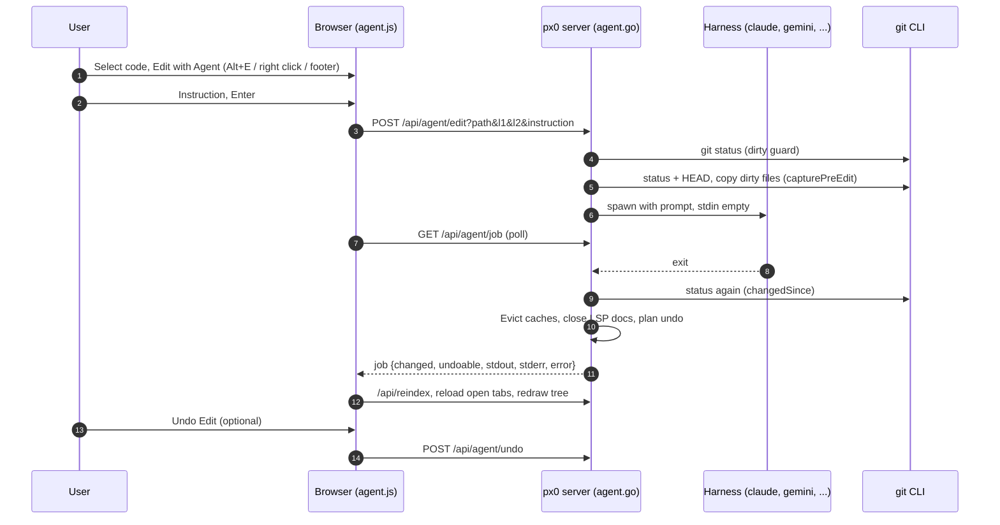

# Harness Editing & Agent Dispatch

This document describes the design and implementation of px0's editing flow:

- dispatch and change detection: [`agent.go`](../../agent.go)
- undo: [`agent_undo.go`](../../agent_undo.go)
- the persisted harness choice: [`settings.go`](../../settings.go)
- the instruction composer, footer controls and undo button: [`web/src/agent.js`](../../web/src/agent.js)
- the selection bar and right-click menu that start an edit: [`web/src/selbar.js`](../../web/src/selbar.js)

Harnesses are discovered automatically, the same way language servers are. Editing becomes available as soon as px0 finds one installed, but nothing ever runs until the user picks one, and that choice is remembered between runs. `-no-agent` removes the feature entirely; `-agent` pins a harness for scripted use and takes the choice away from the UI.

## 1. The Dispatcher Model

px0 does not author changes. No endpoint accepts file content, and the only write px0 makes itself is an undo putting back what a harness changed (section 7).

Editing works by delegation:

1. The user selects a range, in the code view or the diff view, and writes an instruction anchored to it.
2. px0 composes a prompt from that instruction plus the referenced source.
3. px0 snapshots what it needs to undo the run, then spawns a coding harness already installed on the machine, with the workspace as its working directory.
4. The harness makes the change.
5. px0 works out what moved, reloads it in place, and offers to undo it.



The hot path (indexing, highlighting, navigation) is untouched. The whole feature is three Go files, one ES module plus hooks in the selection bar, and six endpoints.

## 2. Starting an Edit

An edit always starts from a selection. The same actions are offered in three places, all backed by `runSelectionAction()` in `selbar.js`:

| Surface | How |
| --- | --- |
| Footer selection bar | `#footer-sel` replaces the footer's left-hand buttons while code is selected. |
| Right-click menu | `#sel-menu`, opened at the pointer by a right click on a selection. |
| Keyboard | `Alt+E` (Edit), alongside `Alt+C`, `Alt+A`, `Alt+U`. |

### The Right-Click Menu

The menu is rebuilt from the footer's own `[data-sel]` buttons every time it opens, so the two can never disagree about which actions exist or whether Edit with Agent is on offer (it is hidden when no harness is available). It takes over the browser's context menu only when the right click lands in the code view or the diff view and there is a selection. A right click on plain code keeps the browser's menu.

Two details keep the selection alive through the right click:

- The viewport's `mousedown` handler in `cursor.js` ignores every button but the primary one, so the caret does not move.
- The capture-phase handler that ends a whole-file (`Ctrl+A`) selection ignores right clicks and clicks inside the menu.

The menu closes on Escape, a click elsewhere, scroll, resize, window blur, or when the selection goes away.

### Selecting in the Diff View

Diff rows carry where they point in the working tree:

- `data-l`: the working-tree line of a context or added row. In the split layout a context line carries it on both sides, so a selection in the left (HEAD) column anchors just as well as one in the right.
- `data-at`: for a deleted row, which has no line on disk, the working-tree line it sat before.

`diffSelection()` gathers the stamped rows the selection intersects. It anchors to the range of `data-l` values, and a context line shown on both sides of a split is counted once. A selection of deleted lines alone anchors to the lines either side of where they were, clamped to the file. The text comes from the `.diff-code` cells alone, so the line-number and `+`/`-` gutters never leak into a prompt. Only the anchor reaches the harness: the prompt carries the lines on disk, not the deleted text.

## 3. Discovery, Selection and the Settings File

`Detect` walks the preset list and resolves each harness with `lookPathIn(name, lspBinDirs())`, the same helper the language-server manager uses. That search covers PATH plus the directories these tools actually install into, such as `~/.local/bin` and npm's global prefix. It runs on every `/api/agent/harnesses` call, so a harness installed after startup appears without a restart.

Discovery alone never enables editing. Finding `claude` on PATH is not consent to let it rewrite a workspace, so the first edit opens a picker and the choice is explicit. Once made, it is remembered and the picker stays out of the way.

The chosen harness is always visible in the footer as `Agent: <name>` (`data-action="agent-harness"`). Clicking it opens a menu of the installed harnesses (`#agent-menu`); picking one calls `/api/agent/select`. When `-agent` pinned the harness, the menu shows the list but says it is fixed for this run. The composer's header has the same switch.

The choice is written to:

```
$XDG_CONFIG_HOME/px0/settings.json     # when XDG_CONFIG_HOME is set
~/.px0/settings.json                   # otherwise
```

```json
{
  "agent": "claude"
}
```

This follows `stateFilePath` in [`update.go`](../../update.go) and sits beside the anonymous ID written by [`telemetry.go`](../../telemetry.go). px0 never writes its own state into a working tree: there is no `.px0/` directory in the repository.

A corrupt or stale settings file is never an error. If the saved harness has since been uninstalled it simply resolves to nothing selected, and the picker appears again.

The spec is persisted exactly as the user gave it. A command template shortens to its binary name for display, so saving the display name would break the round trip.

## 4. The Invocation Contract

Every supported harness starts an interactive session by default and blocks on an approval prompt. A naive spawn therefore hangs forever, producing no output and no error. Each preset carries both the flag that makes the run headless and the flag that lets it apply edits unattended:

| Harness | Argv |
| --- | --- |
| `claude` | `claude -p --permission-mode acceptEdits {prompt}` |
| `gemini` | `gemini --approval-mode auto_edit -p {prompt}` |
| `cursor-agent` | `cursor-agent -p --force {prompt}` |

A full command template is accepted anywhere a harness name is, and must contain `{prompt}`:

```bash
px0 -agent "claude -p --permission-mode acceptEdits {prompt}"
```

The template is split on whitespace, and `{prompt}` is substituted inside each token, so both `{prompt}` and `--prompt={prompt}` work. Presets are a convenience, not a coupling: because a template is always available, a harness that changes its flags is a one-line fix by the user rather than a px0 release.

The binary is resolved before a harness can be selected, so a typo or an uninstalled tool fails at the point of choosing rather than on first use.

### Stdin Stays Empty

`cmd.Stdin` is never set. A harness that still decides to ask something reads EOF and exits, which surfaces as an error in the job. This mirrors the same decision in the language-server installer ([`lspsetup.go`](../../lspsetup.go)) and is the difference between a failed run and a hung one.

### Output and Failures

Stdout and stderr are captured separately into two `tailBuffer`s. The job snapshot carries both (`stdout`, `stderr`, and `log` as an alias of stdout), and a failed run also prints them to the terminal px0 runs in.

A failed job comes back from `/api/agent/job` with an `error` field. The shared `request()` helper in `state.js` turns any `error` into a thrown `Error`, and attaches the parsed body as `e.body`. The poller recognises a job body there and hands it to `finish()` like any other result. The composer then shows the failure inline, under the instruction: the error line, then stderr and stdout in their own labelled blocks. A failure is never only a toast, because the harness's own output is usually the only explanation (an invalid API key, a missing login).

## 5. Single-Flight and the Dirty Guard

One edit runs at a time for the whole workspace. Two harnesses rewriting one tree concurrently produces a state nobody can review afterwards, so a second dispatch is refused with `409` while one is in flight. Changing the harness mid-run is refused for the same reason.

Undo reaches back one edit only. If the target file already holds uncommitted work, that work survives the next edit through undo, but not the one after, so the first dispatch onto a dirty file is refused:

```
main.go has uncommitted changes that this edit would write over
```

The UI asks once and retries with `force=1`. Untracked files are covered too, because the check reads `gitStatus` rather than `git diff HEAD`.

A file open in the diff view has uncommitted changes by definition, so the guard would fire on every edit started there and teach the user to click through it. The changes are on screen and are the reason the user is looking, so edits dispatched from the diff view skip the confirm, and the composer says `Editing uncommitted changes` in place of it.

## 6. Determining What Changed

A harness routinely edits files nobody pointed it at, so the set of touched files is never inferred from the prompt. `changedSince` compares a `worktreeSnapshot` taken before the run with one taken after, in both directions:

- A path whose entry is new or different was touched.
- A path that has left the list entirely was restored to its committed state, which is also a change.

`worktreeSnapshot` is `gitStatus` with each listed file's size and modification time folded into its entry. Status alone misses the most common case in review: editing a file that is already modified reads `M` before and after, so the edit would go unseen and nothing would reload. Clean files are not stamped; a change to one surfaces through status on its own.

That set drives the reload, the undo plan and the summary shown to the user.

Outside a git repository there is no status to compare, so the job reports `tracked: false` and an empty change list. The client treats that as "unknown" rather than "nothing" and reloads the workspace regardless. There is no undo outside git.

## 7. Undo

A harness writes straight to disk, and when a file already held uncommitted work git cannot give the old bytes back. So undo is built from a snapshot px0 takes itself.

### Before the Run: `capturePreEdit`

- `status`: the `worktreeSnapshot` used for change detection.
- `head`: the HEAD commit, from `git rev-parse --verify HEAD`. Empty in a repository with no commits.
- `saved`: the bytes and permissions of every regular file git lists as dirty, up to 8 MB per file (`undoFileBytes`) and 64 MB in total (`undoTotalBytes`). Untracked directories are not copied.
- `missing`: paths git lists but that are not on disk, such as deleted files.

The snapshot lives in memory only.

### After the Run: `planUndo`

Each changed path gets one step:

| State before the run | Undo step |
| --- | --- |
| Dirty and copied | Write the saved bytes back. |
| Clean | Write the blob at the starting HEAD back (`git ls-tree` for mode, `git cat-file blob <head>:./<path>`). |
| Not in HEAD, or listed but missing | Remove the path. |
| Untracked directory that did not exist | Remove the directory. |

Plans are all or nothing. If any path cannot be put back (a dirty file too large to have been copied, or files added to an untracked directory that already existed), the job reports `undoable: false` with the reason in `undoNote`, and no undo is offered. A partial undo would leave a tree nobody asked for.

The plan is built even for a failed run, since whatever the harness wrote before failing still counts. Alongside each step the plan records `pathStamp`, the path's size and modification time as the run left it.

### Applying: `Undo`

- Only the most recent job's plan is kept (`agentManager.undo`). Starting a new edit discards it.
- Undo is refused while a run is in flight.
- Unless forced, undo compares every path's current stamp with the recorded one. Anything that moved since the edit, say from an editor or another tool, is named in a `409` (`a.txt changed since the agent edit`), and the UI asks before retrying with `force=1`.
- The plan is cleared before the first write, so undo is single use even if a write fails part way. A partial failure is reported with a `500` naming each path.
- Restored paths go through the same `settle` as an edit (cache eviction, language-server close), and the client runs the same reload.

In the UI, the footer shows `Undo Edit` (`data-action="agent-undo"`) while the last job is undoable, with the changed files in its tooltip. It confirms with the file list before reverting. On boot, `initAgent()` reads `/api/agent/job`, so the button survives a page reload.

## 8. The Reload Path

The syntax highlighting cache memoises on `path + mtime + size` ([`highlight.go`](../../highlight.go)), so a rewritten file misses the cache on its own and no invalidation is needed for the common case. Two things still need explicit handling:

- Torn reads. `Open` stats and then reads, non-atomically. A harness that truncates and writes in place can be caught mid-write, and that partial copy would then sit under a cache key nothing invalidates. Every changed file is therefore passed to `Evict` before the reload.
- Stale language servers. `gopls` and friends hold their own copy of a file and never saw the write, so go-to-definition and hover would drift. Each changed file is passed to `lsp.CloseDoc`, and the server reopens it on the next request.

The frontend's `reloadWorkspace()` then reloads in dependency order: `/api/reindex` first so the tree and git badges agree with disk, then `reloadOpenTabs()`, then a tree redraw. Edit and undo share it.

### Each Tab Keeps Its View

`reloadOpenTabs()` keeps each tab in the view it was in. A tab in source view stays in source even though the file now has a diff; the tab is marked `diffDismissed` so the gutter load does not flip it either. A tab in the diff view stays there, refetches `/api/diff` for the new document, and restores the diff view's scroll position (`diffScroll`). Scroll position, cursor line and Markdown preview scroll are preserved as before.

### No File Watcher

px0 dispatched the harness, so it knows when the work ended. Completion is detected by the process exiting, not by watching the filesystem. There is no `fsnotify` dependency, no polling of the tree, and the single-binary, zero-dependency footprint is unchanged.

## 9. HTTP Surface

| Endpoint | Method | Purpose |
| --- | --- | --- |
| `/api/agent/harnesses` | GET | Re-scan and list every known harness with its installed state. |
| `/api/agent/select` | POST | Choose a harness and remember it. An empty name turns editing off. |
| `/api/agent/edit` | POST | Dispatch an instruction for `path:l1-l2`. `409` while busy or onto uncommitted work without `force=1`. |
| `/api/agent/job` | GET | Snapshot of the current or most recent run, polled while running. |
| `/api/agent/cancel` | POST | Stop a running harness. Whatever it already wrote stays, and remains undoable. |
| `/api/agent/undo` | POST | Revert the last run's changes. `404` when there is nothing to undo, `409` when busy or when a path changed since (retry with `force=1`). |

A job snapshot:

```json
{
  "id": 3,
  "harness": "claude",
  "path": "server.go",
  "lines": "40-52",
  "running": false,
  "error": "exit status 1",
  "stdout": "…",
  "stderr": "…",
  "log": "…",
  "changed": ["server.go"],
  "tracked": true,
  "undoable": true,
  "undoNote": "",
  "ms": 4425
}
```

`/api/meta` carries `agent` (the selected name, or empty), `agentPinned`, and `agents` (the detected list), so the UI can decide at boot whether to offer editing without a second request.

Every mutating endpoint is guarded by `localPost` ([`lspsetup.go`](../../lspsetup.go)): POST only, `Origin` must match `Host`, and `Host` must be an IP address or `localhost`, which shuts out DNS rebinding.

### Security Posture

The edit endpoint runs a general-purpose coding agent with shell access as the user who started px0, and undo writes to the workspace. `localPost` restricts both to px0's own page reached by IP address or `localhost`. That shuts out other websites and DNS rebinding, and makes editing unavailable through the hostname-based tunnels and reverse proxies described in the README. It is not authentication: with `-host 0.0.0.0`, anyone who can reach px0 by IP, for example over Tailscale, can dispatch an edit. Exposing editing beyond a trusted network requires an authentication story px0 does not yet have.

The explicit first-run pick matters for the same reason. Auto-enabling on discovery would mean any px0 instance on a machine with a harness installed is a code execution endpoint that nobody opted into.

Undo only ever writes paths that git reported as changed by the run, and restores them from bytes px0 captured itself or from the starting commit. It never takes content or paths from the client.

## 10. Limits

- The job keeps the last 32 KB of each of stdout and stderr (`tailBuffer`), enough to explain a failure without holding a full transcript.
- A run is abandoned after 10 minutes.
- Undo covers the most recent edit only, once. Dirty files over 8 MB, or past 64 MB in total, are not copied, and an edit that touches one is not undoable.
- Changes to gitignored files are invisible to `git status`, so they are neither reloaded nor undone.
- A rename the harness stages itself (`git mv`) is seen under its new path only; undo removes the new path but does not restore the old one.
- Instructions and undo snapshots live in memory for the life of the process. Only the harness choice is persisted, and never inside a workspace.
