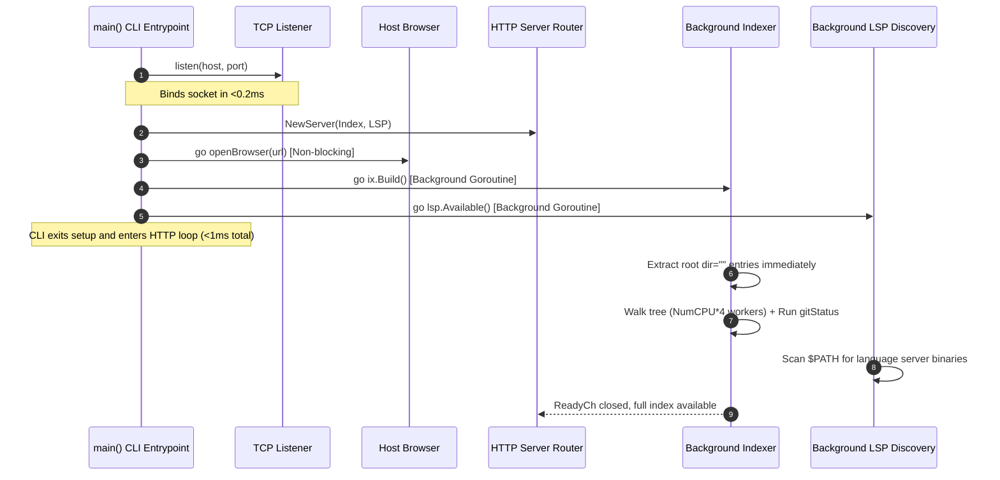

# System Architecture & Runtime Lifecycle

This document describes the high-level architecture, startup pipeline, HTTP server, memory scavenging, and security model of `px0`.

## 1. High-Level Design Principles

px0 is engineered as an ultra-fast, zero-overhead code exploration console. Its architecture is guided by five foundational tenets:

1. Edits Are Delegated: px0 navigates, searches, and inspects code, and does not author changes itself. There are no save buttons and no endpoint accepts file content. Changes are made by a coding harness px0 dispatches on request, one per non-overlapping line range so several can run at once (see [Harness Editing & Agent Dispatch](agent-editing.md)).
1. Single Static Binary Footprint: All frontend assets (HTML, CSS, JavaScript, icons, themes) are embedded directly into the Go binary at compile time via `go:embed`. px0 requires no Node.js, Python, or Ruby runtime, no external database, and no CGO dependencies.
1. Sub-Millisecond Responsiveness: The HTTP listener binds, serves the web UI, and opens the default browser in under 1 millisecond. Heavy operations (full directory indexing, git status checks, language server binary discovery) run asynchronously off the critical path.
1. Stateless in the Workspace: px0 never writes configuration directories, temporary caches, or metadata files (e.g., `.px0/` or `.cache/`) into a workspace. Indexes and caches live in volatile memory. Outside the workspace it keeps only the remembered harness choice and update/telemetry state under `~/.px0/` (or `$XDG_CONFIG_HOME/px0/`).
1. Strict Memory Reclamation: Long-lived background processes should not hold idle RAM. When the user finishes a burst of queries, unused pages are proactively returned to the operating system.

## 2. Startup Pipeline (<1 ms Critical Path)

When `px0` is executed in a terminal (e.g., `px0 .` or `px0 main.go:42`), the initialization flow executes as follows. A file target detects its enclosing project repository (or working directory) as the workspace and is passed to the browser with its relative path and optional line number.



### Key Stages in [`main.go`](../../main.go)

1. Target Resolution: Directories become workspace roots. For a file target, its repository or project root is detected as the workspace, and its relative path (with optional line number) is retained for the initial browser tab. A target of the form `[user@]host:path` that does not exist locally is a remote target and takes the ssh path described in [Section 6](#6-remote-sessions-over-ssh) instead of the local pipeline.
1. Socket Binding: `listen(*host, *port)` binds an ephemeral or user-specified TCP socket immediately.
1. Instant Root Tree Extraction: Before descending into subdirectories, `ix.Build()` extracts and populates the root directory entries (`dir=""`), publishing them directly to `ix.children[""]`. When the browser makes its initial request to `/api/tree`, it immediately renders the root tree nodes without waiting for the deep repository scan to finish.
1. Non-Blocking Browser Launch: `go openBrowser(url)` spawns the platform-specific browser opener (`xdg-open` on Linux, `open` on macOS, `rundll32` on Windows) in a separate goroutine.
1. Concurrent Tree Walk & Git Status: Indexing runs inside a background goroutine. A dedicated goroutine runs `gitStatus(ix.root)` in parallel with the file walk so that subprocess overhead overlaps the walk rather than adding to it.
1. Background Language Server Discovery: `lsp.Available()` checks `$PATH` using `exec.LookPath` across standard binary locations asynchronously.

## 3. HTTP Server & API Catalog

The server is implemented in [`server.go`](../../server.go) using Go's standard `http.ServeMux`. Every request passes through a centralized `ServeHTTP` wrapper that records activity timestamps, tracks status codes and durations, applies pooled Gzip compression when accepted by the client (excluding SSE streams), and logs every HTTP request to the terminal when the `-verbose` flag is active.

### Endpoints Reference

| Endpoint              | Method | Purpose                                                                 | Response Format                            |
| --------------------- | ------ | ----------------------------------------------------------------------- | ------------------------------------------ |
| `/`                   | `GET`  | Serves `web/index.html` (embedded or `-dev` disk copy)                  | `text/html; charset=utf-8`                 |
| `/static/*`           | `GET`  | Serves bundled JavaScript, CSS, and static assets                       | Asset MIME type                            |
| `/static/themes.css`  | `GET`  | Concatenates all `web/themes/*.css` files in alphanumeric order         | `text/css; charset=utf-8`                  |
| `/api/meta`           | `GET`  | Workspace metadata (root path, file count, index duration, git status)  | JSON (`{root, name, files, build_ms, git}`)|
| `/api/metrics`        | `GET`  | Point-in-time process memory, CPU, and goroutine stats (polled via `/api/stream` SSE) | JSON (`{rssBytes, cpuUsage, goroutines}`)|
| `/api/tree`           | `GET`  | Directory contents for the sidebar file explorer (`?dir=path`)          | JSON array of `Node` objects               |
| `/api/file`           | `GET`  | Windowed, highlighted source file lines (`?path=...&start=0&count=500`) | JSON (`{lines, total, refine, markdown}`)  |
| `/api/raw`            | `GET`  | Raw, unhighlighted file content for whole-file copies and preview assets| `text/plain` or binary                     |
| `/api/markdown`       | `GET`  | Converted HTML preview of `.md` / `.markdown` files via goldmark        | JSON (`{path, html}`)                      |
| `/api/find`           | `GET`  | Fast fuzzy match against all indexed workspace paths (`?q=...`)         | JSON array of `FuzzyResult` objects        |
| `/api/search`         | `GET`  | Full-text project grep with snippet elision (`?q=...&case=...&regex=...`)| JSON array of file hits and matches        |
| `/api/outline`        | `GET`  | Regex-extracted symbol outline for a given file (`?path=...`)          | JSON array of symbol declarations          |
| `/api/def`            | `GET`  | Quick definition lookup fallback                                        | JSON array of matching definition locations|
| `/api/diff`           | `GET`  | Unified diff of working tree vs. `HEAD` (`?path=...`)                   | JSON (`{path, diff, available}`)           |
| `/api/gutter`         | `GET`  | Per-line change markers for code view gutter                            | JSON (`{added, modified, deleted}`)        |
| `/api/stream`         | `GET`  | Unified SSE stream for real-time `git-status` and `metrics` events (aliased by `/api/git/stream`) | `text/event-stream`   |
| `/api/git/refresh`    | `POST` | Triggers immediate git status check and returns status payload          | JSON (`{git, gitChanges, gitFiles, ...}`)  |
| `/api/reindex`        | `POST` | Re-runs index walk and git status on demand (triggers frontend tab reload; see [`file-reload-and-updates.md`](file-reload-and-updates.md)) | JSON (`{files, indexMs}`)                  |
| `/api/lsp/def`        | `GET`  | Go-to-Definition via LSP (`?path=...&line=...&col=...`)                 | JSON array of target locations             |
| `/api/lsp/refs`       | `GET`  | Find References via LSP                                                 | JSON array of reference locations          |
| `/api/lsp/calls`      | `POST` | Incoming/outgoing call hierarchy tree expansion                         | JSON array of `CallNode` objects           |
| `/api/lsp/symbols`    | `GET`  | Document symbols extracted via LSP                                      | JSON array of LSP symbols                  |
| `/api/lsp/hover`      | `GET`  | Type signature and markdown doc hovercard info                          | JSON (`{contents: ...}`)                   |
| `/api/lsp/warm`       | `POST` | Pre-warms or spawns language server for given file extension            | JSON (`{ok: true}`)                        |
| `/api/lsp/setup`      | `GET`  | Reports install status and commands for current file language           | JSON (`{installed, recipes, ...}`)         |
| `/api/lsp/install`    | `POST` | Executes user-level installer in background                             | JSON (`{ok: true}`)                        |
| `/api/lsp/start`      | `POST` | Rescans and starts language server after installation                   | JSON (`{ok: true}`)                        |
| `/api/agent/harnesses`| `GET`  | Detected coding harnesses and the current choice                        | JSON (`{harnesses, selected, pinned, settings}`) |
| `/api/agent/select`   | `POST` | Choose and remember a harness (`?name=...`)                             | JSON (`{harnesses, selected, pinned, settings}`) |
| `/api/agent/edit`     | `POST` | Dispatch an instruction to the harness (`?path=...&l1=...&l2=...&instruction=...`) | JSON job snapshot               |
| `/api/agent/job`      | `GET`  | Snapshot of job `?id=...`, or the most recently started when omitted: output, changed files | JSON job snapshot          |
| `/api/agent/cancel`   | `POST` | Stop every running harness                                              | JSON (`{cancelled}`)                       |

## 4. Memory Management & Proactive Scavenging

Even though Go's garbage collector frees unreferenced heap objects rapidly, the Go runtime does not immediately release physical memory pages back to the host operating system. In high-churn CLI sessions (such as searching a 50,000-file repository), the process resident set size (RSS) could appear inflated long after the search completes.

To maintain a lean footprint (~20 MB RSS), `server.go` implements an automatic scavenger:

```go
func (s *Server) scavenge() {
    const idleFor = 15 * time.Second
    tick := time.NewTicker(10 * time.Second)
    defer tick.Stop()
    done := true
    for range tick.C {
        idle := time.Since(time.Unix(0, s.lastReq.Load()))
        if idle < idleFor {
            done = false
            continue
        }
        if done {
            continue
        }
        debug.FreeOSMemory()
        done = true
    }
}
```

### Scavenging Mechanism

- `s.lastReq`: An atomic 64-bit integer tracks the Unix timestamp (in nanoseconds) of the most recent incoming HTTP request.
- When no HTTP traffic has arrived for 15 seconds after an active period, `debug.FreeOSMemory()` is invoked.
- Physical memory pages freed by the GC are surrendered back to the operating system kernel immediately, preventing background memory bloat.

### Gzip Buffer Pooling

To avoid heap allocations on every JSON endpoint response, `gzip.Writer` instances are pooled via `sync.Pool` using `gzip.BestSpeed`:

```go
var gzipPool = sync.Pool{New: func() any {
    w, _ := gzip.NewWriterLevel(io.Discard, gzip.BestSpeed)
    return w
}}
```

## 5. Security Model & Path Sandboxing

Because px0 exposes a local HTTP server that can display source files and interact with local tools, strict boundary constraints are enforced.

### Path Resolution (`safePath` & `resolvePath`)

Paths supplied by client queries are rigorously sanitized:

1. Leading slashes and spaces are trimmed.
1. The path is cleaned via `filepath.Clean()`.
1. Paths attempting directory traversal (`..`, `../`, or containing `..` path segments) are rejected with HTTP 400.
1. Any path that resolves outside the indexed workspace root is rejected, unless it has been explicitly admitted into the external path allowlist (`extAllowed`).

### External Path Allowlist (`extAllowed`)

When navigating code via LSP Go-to-Definition, targets often reside outside the workspace directory (e.g., standard library packages in `/usr/local/go/src` or cached crates in `~/.cargo/registry`).

- Rather than opening up arbitrary filesystem reads, targets returned by the trusted LSP server are admitted into an in-memory allowlist: `extAllowed[canonicalPath] = true`.
- `/api/file` and `/api/raw` permit reading external files only if the exact path exists in `extAllowed`.
- External paths can never be enumerated via `/api/tree` or searched via `/api/search`.

### Origin Verification for Installers

The `/api/lsp/install` and `/api/lsp/start` endpoints execute shell commands (e.g., `go install ...` or `npm install -g ...`), and the `/api/agent/*` mutations run a coding harness. To guard against cross-origin attacks (such as a malicious website triggering command execution via JavaScript fetch while px0 is running in the background):

1. The request method must be `POST`.
1. The request `Origin` header must match the request `Host` header.
1. The `Host` header is validated to ensure it is strictly an IP address (`127.0.0.1`, `[::1]`) or `localhost`. This prevents DNS-rebinding attacks.
1. The executed command is never supplied by the client; it is looked up exclusively from the hard-coded internal `lspRegistry`, or, for agent edits, from the harness the user picked (only the instruction text comes from the client).

### Self-Update Integrity

Before `px0 --update` executes or installs a release binary, it verifies the download against the SHA-256 digest in that release's `checksums.txt` asset. Missing, malformed, or mismatched checksum data aborts the update without replacing the current executable.

## 6. Remote Sessions over ssh

`px0 user@host:path` ([`remote.go`](../../remote.go)) runs px0 on another machine and forwards its port to the local browser. It is the remote-first story with the network setup removed: nothing on the remote is bound beyond loopback, and authentication is whatever the user's ssh client already does.

### Target Recognition (`parseRemoteTarget`)

A target is remote only when it does not exist locally and has the scp shape `[user@]host:path` (host limited to letters, digits, `.`, `-`, `_` and one `@`, never starting with `-` so it cannot be read as an ssh flag). URLs are not accepted; ssh options such as ports and identity files belong in `~/.ssh/config`. Two shapes are deliberately left local: `file.go:12` for a missing file, so the usual error is reported, and `host:8080`, where an all-digit remainder is a line number rather than a path. An empty path means the login directory; `~/x` expands on the remote.

### Session Flow

```mermaid
sequenceDiagram
    autonumber
    participant Local as local px0
    participant SSH as ssh -L 127.0.0.1:L:127.0.0.1:R
    participant Launcher as remote sh launcher
    participant Remote as remote px0 (loopback:R)
    participant Browser

    Local->>Local: reserve local port L (listen, close)
    Local->>Local: pick random remote port R (20000-60000)
    Local->>SSH: start, stdin held open, stdout parsed, stderr relayed
    SSH->>Launcher: sh -c script
    Launcher->>Launcher: locate px0 (PATH, ~/.local/bin, ~/bin, /usr/local/bin, /opt/homebrew/bin)
    Launcher->>Remote: px0 -no-open -no-color -port R [passthrough] -- path
    Remote-->>Local: banner with url http://127.0.0.1:R/...
    Local->>Local: rewrite url to 127.0.0.1:L
    Local->>Browser: openBrowser(local url)
    Note over Local,Remote: narration relayed; edits work (page reached by IP)
    Local->>SSH: Ctrl-C / exit closes stdin
    Launcher->>Remote: watcher sees EOF, kill px0 (SIGTERM)
    Remote-->>Launcher: exits, wait returns, session ends
```

- Port choice: the local end is reserved with `listen()` and released for ssh to bind (`ExitOnForwardFailure=yes` makes a lost race fatal and visible). The remote end is a random port; px0 walks forward when its port is busy, so the printed URL is checked against the requested port and the session is restarted with a new port on a mismatch.
- Lifetime: the launcher duplicates the session's stdin onto fd 3 and runs `cat <&3` in a background watcher (a background list in a non-interactive shell would otherwise read `/dev/null`); EOF on it kills px0. `wait` on px0 ends the launcher when px0 exits on its own, so a failing start ends the session and the local side reports it. `ServerAliveInterval` makes a dead link end the session too.
- Output: the remote's stdout passes through unchanged except for two lines: the `url:` line, whose address is rewritten to the local end, and the version heading, which gains the local version when the two differ. ssh's stderr is inherited. Password, passphrase and host-key prompts are unaffected: ssh reads those from the terminal, not stdin.
- Flags: `-port` is the local end of the forward; `-host` and `-dev` do not apply; `-no-lsp`, `-no-git`, `-agent`, `-no-agent`, `-no-telemetry` and `-verbose` are repeated to the remote px0, quoted for `sh`.

### Installing on the Remote

When the launcher finds no px0 it prints `px0-remote: missing <uname -s> <uname -m>` and exits 3. The local side asks the user (no terminal on stdin means no) and then streams a binary over a second ssh session into `~/.local/bin/px0`. The remote always receives the local version: the running executable when GOOS/GOARCH match, otherwise the release asset for the remote's platform, downloaded locally and verified against the release's `checksums.txt` with the same helper `-update` uses. The remote therefore needs no network access, and both ends run the same code, which is what keeps flag and output compatibility a non-issue. A local build with no published release cannot install cross-platform and says so. The session is then started again; a second miss after an install is reported rather than retried.

### Security Properties

- The remote px0 binds `127.0.0.1` only. It is reachable solely through the ssh forward, whose local end is also loopback.
- The browser's `Host` is `127.0.0.1:L`, an IP address, so `localPost` admits agent edits and language-server installs. Those run on the remote as the ssh user, which is the intended use: the harness runs where the code is. Anything that can reach the local forward port can dispatch them, the same trust boundary as a local px0.
- The remote path is quoted for `sh` (`shellQuote`), with only a leading `~` expanded. Passthrough flags are quoted the same way. The ssh destination is passed after `--`.
- Nothing is written on the remote except, with consent, the installed binary in `~/.local/bin`. Nothing is written locally.
