# File Updates & In-Place Tab Reloading

This document details the end-to-end architecture, performance optimizations, and edge-case handling for workspace file updates and tab reloading ([`web/src/tabs.js`](../../web/src/tabs.js), [`web/src/panels.js`](../../web/src/panels.js), [`server.go`](../../server.go), and [`highlight.go`](../../highlight.go)), introduced in commit `c33376b4b43b2ae3ecbc6fedd45b9dee0726a401`.

---

## 1. Problem Statement & Motivation

Most file mutations (such as `git checkout`, `git pull`, branch switching, code generation, or edits from an external IDE) occur on the host filesystem outside of px0's process boundary. Edits px0 dispatches to a coding harness, and their undo, reuse the same reload path once they finish (see [Harness Editing & Agent Dispatch](agent-editing.md)).

Users trigger a workspace re-index by clicking the **Re-index** button (`#btn-reindex` in the sidebar header) or via the Command Palette (`Mod+K` &rarr; `Re-index Workspace`).

### The Historical Limitation

Prior to this implementation:
1. Re-indexing rescanned the directory tree via `POST /api/reindex` and redrew the file explorer.
2. **Open tabs remained stale**: The document objects in memory (`S.tabs`) retained old file lines, stale line totals, outdated git diff annotations, and previous syntax highlighting states.
3. If an open file was edited or truncated on disk, px0 showed stale cached lines. If the file shrank, attempting to scroll or jump to previous line numbers resulted in blank lines or out-of-bounds errors.
4. Users were forced to manually close and re-open every tab, or execute a full browser reload (which destroyed active tabs, cursor positions, navigation history, and scroll offsets).
5. Simply re-running `openFile()` in a loop across open tabs was unacceptable: it caused jarring tab-switching UI flicker, multiple full-DOM layout calculations, scroll resets, and history stack pollution.

The solution is `reloadOpenTabs()`: a quiet, concurrent, in-place tab synchronization engine that refreshes all open tabs without tab-switching thrash, preserving exact viewport and caret states while gracefully handling file mutations.

---

## 2. End-to-End Architectural Flow

The diagram below maps the complete lifecycle of a file reload triggered by workspace re-indexing:

```mermaid
sequenceDiagram
    autonumber
    actor User
    participant UI as Sidebar / Palette
    participant Panels as web/src/panels.js
    participant Tabs as web/src/tabs.js (reloadOpenTabs)
    participant Server as Go Backend (/api/reindex & /api/file)
    participant Cache as highlight.go (Doc Cache)
    participant Renderer as web/src/renderer.js (layout & render)

    User->>UI: Click "#btn-reindex" or run Palette command
    UI->>Panels: Trigger click listener
    Panels->>Server: POST /api/reindex
    Server->>Server: Rescan index & run git status (porcelain=v2)
    Server-->>Panels: Return {files, indexMs}
    Panels->>Panels: Redraw file explorer tree
    Panels->>Tabs: await reloadOpenTabs()

    rect rgb(30, 35, 45)
        note over Tabs: Step 1: Pre-flight Snapshotting
        Tabs->>Tabs: Capture live activeDoc.scrollTop from vp.scrollTop
        Tabs->>Tabs: If previewing markdown: capture mdview.scrollTop
        Tabs->>Tabs: Compute chunk start for each open tab based on cur anchor
    end

    rect rgb(35, 40, 55)
        note over Tabs,Server: Step 2: Concurrent Batch Fetching
        Tabs->>Server: Promise.allSettled(api('/api/file', {path, start, count}))
        Server->>Cache: Open(abs, rel) with stat check (key = abs|mtime|size)
        alt File Changed on Disk
            Cache->>Cache: Cache miss -> Read file -> Windowed Chroma highlight
        else File Unchanged
            Cache-->>Server: Cache hit -> Return memoized Doc
        end
        Server-->>Tabs: Return JSON payload {total, lines, maxCols, diffAvailable, lsp}
    end

    rect rgb(30, 45, 35)
        note over Tabs: Step 3: In-Place Document Construction & Reconciliation
        loop For each target tab
            Tabs->>Tabs: Validate tab still open (S.tabs.indexOf(oldDoc) >= 0)
            Tabs->>Tabs: Clamp cur line to new total (Math.min(cur, total))
            Tabs->>Tabs: Preserve diffMode, diffDismissed, and col
            Tabs->>Tabs: Construct new doc object d & populate line chunk
            Tabs->>Tabs: S.tabs[idx] = d (replace in-place without tab switch)
            Tabs->>Tabs: Dispatch background refineChunk() & loadGutter()
        end
    end

    rect rgb(45, 35, 35)
        note over Tabs,Renderer: Step 4: Single-Pass Resync & Viewport Restoration
        Tabs->>Tabs: Sync active doc LSP, Markdown preview, and Diff views
        Tabs->>Renderer: layout() (recalculate sizer height/width)
        Tabs->>Tabs: Restore vp.scrollTop = d.scrollTop
        Tabs->>Renderer: render() (virtualized rows mount)
        Tabs->>Tabs: Re-fetch Outline if active, drawTabs(), drawCrumbs(), updateStatus()
    end
```



---

## 3. Step-by-Step Implementation Mechanics

### Step 1: Live State Snapshotting

Before issuing any network requests, `reloadOpenTabs` captures volatile DOM scroll positions:

```javascript
const activeDoc = doc_();
if (activeDoc) {
  activeDoc.scrollTop = vp.scrollTop;
  if (previewing(activeDoc)) {
    const mv = $('#mdview');
    if (mv) activeDoc.mdScroll = mv.scrollTop;
  }
}
```

- **Viewport DOM Offset**: While `activeDoc.scrollTop` is maintained in memory during tab switches, native mouse-wheel or trackpad scrolling mutates `vp.scrollTop` directly. Snapshotting guarantees the live scroll offset is preserved.
- **Markdown Preview Offset**: Markdown preview uses a decoupled overlay container (`#mdview`). Its scroll offset is independent of the editor virtualizer `#viewport`, so `mdScroll` is recorded separately.

### Step 2: Virtualized Chunk Target Calculation

Instead of fetching entire files, px0 leverages its windowed virtualization architecture (`CHUNK = 1000` lines):

```javascript
const targets = S.tabs.map(t => ({
  oldDoc: t,
  path: t.path,
  anchor: t.cur || 1,
  start: t.cur ? Math.max(0, Math.floor((t.cur - 1) / CHUNK) * CHUNK) : 0,
}));
```

- Each tab's current viewing line (`t.cur`) acts as the anchor.
- px0 calculates the precise 1000-line chunk boundary enclosing that anchor:
  $$\text{start} = \left\lfloor \frac{\text{cur} - 1}{\text{CHUNK}} \right\rfloor \times \text{CHUNK}$$
- Offscreen chunks are not requested upfront; they load on-demand when scrolled into view via `ensureChunk()`.

### Step 3: Concurrent Non-Blocking Fetching (`Promise.allSettled`)

All open tabs are re-fetched concurrently:

```javascript
const results = await Promise.allSettled(
  targets.map(tgt => api('/api/file', { path: tgt.path, start: tgt.start, count: CHUNK }))
);
```

- **`Promise.allSettled` vs. `Promise.all`**: If an open file was deleted, locked, or became inaccessible on disk, `Promise.all` would abort the entire batch. `Promise.allSettled` ensures successful tab updates proceed uninterrupted regardless of individual file errors.
- **Network Pipeline**: Dispatched simultaneously over HTTP/1.1 keep-alive or HTTP/2 multiplexing.

### Step 4: Backend Invalidation & Cache Coherence

On the Go server, `/api/file` calls `Open(abs, rel)` in [`highlight.go`](../../highlight.go):

```go
key := fmt.Sprintf("%s|%d|%d", abs, st.ModTime().UnixNano(), st.Size())
if d := cache.get(key); d != nil {
    return d, nil
}
```

- **Compound Key Invalidation**: The server cache key includes the file's absolute path, nanosecond modification timestamp (`ModTime().UnixNano()`), and byte size.
- **Zero-Cost Unchanged Reads**: If a file was untouched during workspace re-indexing, its key matches the LRU cache. The server serves the cached `Doc` without re-reading the filesystem or re-running Chroma tokenization.
- **Automatic Invalidation**: If the file was modified, the timestamp/size changes, triggering a cache miss, fresh disk read (`os.ReadFile`), and Lexer pass.

### Step 5: In-Place Document Construction & Tab Replacement

When reconciling each tab result:

```javascript
const idx = S.tabs.indexOf(tgt.oldDoc);
if (idx < 0) continue; // Tab was closed while reload was in-flight

// Handle errors gracefully
if (res.status !== 'fulfilled') {
  if (idx === S.active) {
    setStatusNote(tgt.path + ': ' + (res.reason?.message || 'failed to load'));
  }
  continue;
}

const j = res.value;
if (j.image) continue;

const keep = tgt.oldDoc;
const hasDiff = !!j.diffAvailable;
const newCur = Math.max(1, Math.min(keep.cur || 1, j.total));
```

- **In-Place Mutation**: `S.tabs[idx] = d` swaps the document instance inside the array directly. The active tab index (`S.active`) remains unchanged, completely avoiding tab activation events.
- **New Line Buffer**: A new array `d.lines = new Array(j.total)` is allocated to the new line count, and the returned lines are inserted at `j.start`.
- **Chunk Tracking**: `d.chunks = new Set([tgt.start / CHUNK])` records the refreshed chunk. All other chunks are cleared so they fetch fresh content if scrolled into view.
- **Gutter & Lexer Refinement**: `loadGutter(d)` is dispatched to fetch fresh Git line diff markers, and `refineChunk(d, ...)` is called if Chroma emitted an inexact first-pass window.

### Step 6: Active Document Resynchronization & Single-Pass Render

Once all tabs have been updated in memory, px0 updates the view surface:

```javascript
const d = doc_();
if (d) {
  S.lsp.state = (d.lsp && d.lsp.state) || 'off';
  S.lsp.server = (d.lsp && d.lsp.server) || '';
  S.lsp.missing = (d.lsp && d.lsp.missing) || '';
  warmLSP(d);
  syncPreview();
  syncDiffView();
  layout();
  vp.scrollTop = d.scrollTop;
  render();
  if ($('#panel-outline')?.classList.contains('active')) loadOutline();
}

drawTabs();
drawCrumbs();
updateStatus();
```

- **Single Layout & Paint Budget**: Rather than re-rendering for each tab, a single `layout()` recalculates the sizer dimensions and a single `render()` mounts the ~60 visible rows into the DOM.
- **Viewport Scroll Restoration**: `vp.scrollTop = d.scrollTop` restores the user's exact scroll position on the freshly-sized canvas.
- **Outline Panel Resync**: If the symbol outline sidebar is active, `loadOutline()` re-extracts declarations against the updated file.

---

## 4. Performance Optimizations

| Optimization | Technique | Impact |
| :--- | :--- | :--- |
| **Zero Tab-Switching Thrash** | Direct in-place array assignment (`S.tabs[idx] = d`) without calling `openFile()` | Eliminates $N$ DOM reflows, tab button CSS transitions, and navigation history pollution. |
| **Single Reflow / Render Budget** | Deferred `layout()` and `render()` called once after all tabs are resolved | Keeps UI execution within the sub-millisecond frame budget regardless of open tab count. |
| **Anchor-Bounded Chunk Loading** | Requests only the 1000-line chunk containing `cur` (`CHUNK = 1000`) | Network transfer payload remains $O(1)$ relative to total file size. |
| **Concurrent Network Fetching** | `Promise.allSettled` over parallel HTTP connections | Overcomes serialized network latency across multi-tab sessions. |
| **Server-Side Stat Validation** | `key = abs \| mtime \| size` caching in `highlight.go` | Bypasses disk I/O and syntax tokenization for all unmodified open files. |
| **Non-Blocking Auxiliary Tasks** | Asynchronous `loadGutter()` and `refineChunk()` calls | Git diff markers and exact lexer refinements load in the background without stalling editor paint. |

---

## 5. Edge Cases & Resilience

### 1. Concurrent Tab Closure during In-Flight Network Requests
- **Problem**: While `Promise.allSettled` is waiting on HTTP responses, the user might close one or more tabs.
- **Solution**: px0 looks up the index dynamically using the object reference captured before the request:
  ```javascript
  const idx = S.tabs.indexOf(tgt.oldDoc);
  if (idx < 0) continue;
  ```
  If the tab was closed, `idx` evaluates to `-1`, and the response is safely discarded without corrupting the tab array or array bounds.

### 2. File Shrinkage & Caret Out-of-Bounds Clamping
- **Problem**: An external process or branch switch truncates a 2,000-line file down to 50 lines while the user's cursor was at line 1,250. Retaining line 1,250 would cause blank virtualized rows and broken cursor rendering.
- **Solution**: The cursor position is clamped to the new file total:
  ```javascript
  const newCur = Math.max(1, Math.min(keep.cur || 1, j.total));
  ```
  Cursor line `cur` is guaranteed to satisfy $1 \le \text{cur} \le \text{total}$. Cursor horizontal column (`keep.col`) is safely retained.

### 3. File Deletion or Permission Revocation on Disk
- **Problem**: An open file is deleted or renamed externally before re-indexing. The backend `/api/file` endpoint responds with a `404` or `500` error.
- **Solution**: `Promise.allSettled` isolates the rejection. The old tab remains loaded and functional in the UI. If the deleted file is the currently active tab, an unobtrusive status bar warning is displayed (`setStatusNote`), preventing application crashes or blank editor views.

### 4. Diff View Preference & Dismissal Persistence
- **Problem**: A file with uncommitted Git changes might have diff mode active or dismissed by the user. On reload, Git diff availability may appear or disappear.
- **Solution**: A reload keeps each tab in the view it was in:
  ```javascript
  const diffMode = hasDiff ? (keep.diffMode || null) : null;
  // ...
  diffDismissed: !!keep.diffDismissed || !keep.diffMode,
  diffScroll: keep === activeDoc && keep.diffMode ? diffScrollTop() : 0,
  ```
  - A tab in source view stays in source, even when the reload finds new changes (for example after an agent edit). It is marked `diffDismissed`, so `loadGutter()` does not switch it to the diff either. The Diff button is one click away.
  - A tab in the diff view keeps its split or unified layout, and the active tab's diff scroll offset is restored once the new diff renders.
  - If changes were committed externally, `hasDiff` evaluates to `false`, and `diffMode` cleanly resets to `null`.
  - Opening a file fresh is unaffected: a modified file still opens in the diff view.

### 5. Markdown Preview Scroll Offset Preservation
- **Problem**: In Markdown preview mode (`#mdview`), the preview is rendered inside an independent HTML container rather than the virtualized line scroller (`#viewport`). Re-rendering resets scroll containers to `0`.
- **Solution**: `reloadOpenTabs` captures `activeDoc.mdScroll = $('#mdview').scrollTop` during pre-flight and passes `mdScroll: keep.mdScroll || 0` to the new document state, which `syncPreview()` restores upon re-render.

### 6. Binary & Image Tab Protection
- **Problem**: If a file extension was replaced with an image or binary file, passing it to the text virtualization buffer would corrupt line array parsing.
- **Solution**: `if (j.image) continue;` skips image tabs, allowing specialized image rendering flows to handle the media.

---

## 6. Related Documentation

- [System Architecture & Runtime Lifecycle](architecture.md) — HTTP router, lifecycle, and proactive memory management.
- [Editor Virtualization & Caret Engine](editor-virtualization.md) — Viewport virtualization, DOM recycling, and selection preservation.
- [Git Awareness & Diffing](git-integration.md) — CLI shell-out git status generation and diff view synchronization.
- [Windowed Syntax Highlighting](syntax-highlighting.md) — Dual-tier Chroma tokenization and chunked line streaming.
