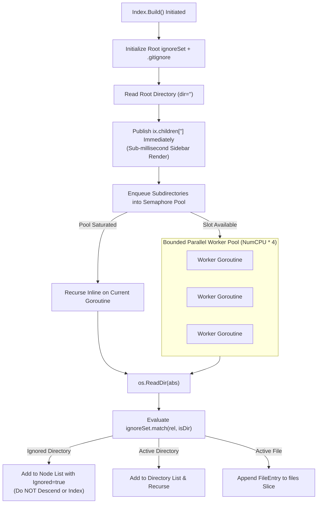

# Filesystem Indexing & Ignore Engine

This document explains the technical implementation of px0's in-memory indexer ([`index.go`](../../index.go)) and custom `.gitignore` evaluation engine ([`ignore.go`](../../ignore.go)).

## 1. Directory Traversal Architecture

Indexing thousands of directories and tens of thousands of source files must complete in milliseconds without exhausting system memory or file descriptors.



### Bounded Concurrency Semaphore

Unbounded goroutine creation during directory traversal can cause thread contention, high memory churn, and "too many open files" errors. px0 controls traversal concurrency using a buffered channel semaphore:

```go
sem := make(chan struct{}, runtime.NumCPU() * 4)
```

When a subdirectory is discovered:

```go
select {
case sem <- struct{}{}:
    go func(a, r string, g *ignoreSet) {
        defer func() { <-sem }()
        walk(a, r, g)
    }(sd.abs, sd.rel, ig)
default:
    walk(sd.abs, sd.rel, ig) // Pool saturated: recurse inline
}
```

If all worker slots are occupied, the current goroutine processes the subdirectory directly (inline execution). This ensures the work queue never balloons in memory, scheduling overhead remains negligible, and CPU cache locality is preserved.

### Immediate Root Publishing

To achieve sub-millisecond startup, the root directory (`rel == ""`) is read and sorted first:

```go
if rel == "" {
    ix.mu.Lock()
    ix.children[""] = kids
    ix.mu.Unlock()
}
```

The browser frontend can fetch and render the primary workspace tree via `/api/tree?dir=` instantly, while the background worker pool completes recursive indexing of subdirectories.

### Symlink Cycle Immunity

Directory symlinks are systematically ignored:

```go
if e.Type()&os.ModeSymlink != 0 {
    continue
}
```

This guarantees immunity against recursive directory loops (e.g., circular symlinks created by package managers or container runtimes) and eliminates costly filesystem `stat` calls.

## 2. In-Memory Data Structures

The index prioritizes low memory footprint and cache-friendly layout for fuzzy matching and search.

### `FileEntry`

```go
type FileEntry struct {
    Path      string `json:"path"`      // Slash-separated relative path
    Name      string `json:"name"`      // Basename
    Size      int64  `json:"size"`      // File size in bytes
    lower     string // Precomputed lowercase Path for instant matching
    nameStart int    // Index in Path where the basename begins
}
```

- Precomputed Lowercase (`lower`): Computed once during traversal. Fuzzy matching and case-insensitive queries run directly against this slice without string allocations during user typing.
- `nameStart`: Caches the byte offset of the basename (e.g., `src/components/Button.tsx` $\to 15$). This allows the fuzzy scoring matrix to award basename match bonuses without runtime string splitting.

### `Node` (Explorer Tree Representation)

```go
type Node struct {
    Name    string `json:"name"`
    Path    string `json:"path"`
    Dir     bool   `json:"dir"`
    Size    int64  `json:"size"`
    Ignored bool   `json:"ignored,omitempty"` // Matched by .gitignore: listed, never indexed
    Status  string `json:"status,omitempty"`  // Git status: M, A, D, U, etc.
    Dirty   bool   `json:"dirty,omitempty"`   // Contains git-modified descendants
}
```

## 3. High-Performance `.gitignore` Engine

Evaluating regular expressions for hundreds of `.gitignore` patterns against tens of thousands of paths can cripple indexing performance. In [`ignore.go`](../../ignore.go), px0 classifies patterns into specialized non-regex fast paths and adds heuristic pre-filters to regexes.

### Rule Classification (`ruleKind`)

```go
type ruleKind uint8

const (
    rkRegex     ruleKind = iota // Wildcards requiring regex (guarded by filters)
    rkSegEq                     // Exact segment match: "node_modules", "dist"
    rkSegSuffix                 // Suffix match: "*.pyc", "*.log"
    rkPathEq                    // Anchored path match: "/build", "docs/draft"
)
```

#### Fast-Path Evaluation

When testing a path against a rule:

- `rkSegEq`: Checks whether any segment of `path` exactly matches the literal string (`seg == r.lit`). Avoids regex engines entirely.
- `rkSegSuffix`: Checks whether any segment ends with the suffix (`strings.HasSuffix(seg, r.lit)`).
- `rkPathEq`: Compares path prefix or exact match (`strings.HasPrefix(rel, r.lit)`).

#### Regex Pre-Filtering

For patterns that require regular expressions (e.g., `**/foo[0-9]*/**`), two pre-checks eliminate ~99% of regex executions:

1. `prefix` Test: If the pattern is anchored (e.g., `/foo/**/bar`), `strings.HasPrefix(rel, r.prefix)` is verified before invoking the regex.
1. `must` Substring Test: The longest non-wildcard run in the pattern is extracted. Any candidate path must contain this literal substring (`strings.Contains(rel, r.must)`), otherwise the regex engine is never called.

### Hierarchical `ignoreSet`

Directories can contain nested `.gitignore` files that override or extend parent rules:

- `ignoreSet` forms a linked tree where child directories point to their parent `ignoreSet`.
- When entering a directory containing a `.gitignore`, a child set is constructed with `ig.child(readGitignore(abs, rel))`.
- Rules are evaluated from child to root, respecting negation patterns (`!file.txt`).

## 4. Ignored Directory Semantics (Listing vs. Descent)

px0 implements a clear distinction between ignored entries and version control internals:

1. Version Control Internals (`.git`, `.hg`, `.svn`): Dropped completely. They are neither indexed nor listed in `/api/tree`.
1. Ignored Directories (`node_modules/`, `target/`, etc.): Added to the parent node listing with `Ignored: true`. Never descended into during `Index.Build()`. Never entered into the flat `files` slice used by fuzzy find and workspace search. The file explorer displays them with dimmed opacity.
1. On-Demand Expansion (`Index.Children` & `listIgnored`): If the user clicks to expand an ignored folder in the explorer sidebar, `Children()` detects that the directory was ignored and reads only that single directory from disk on demand (`os.ReadDir`). Every child inside it is marked `Ignored: true`, adhering to git semantics: nothing beneath an excluded directory can be re-included. Traversal protection (`underIgnoredLocked`) ensures that crafted paths with `.` or `..` segments are rejected before accessing the filesystem.

The explorer's Expand All action follows the same `/api/tree` path for each indexed directory. It requests at most four directories at a time and adds their children to a queue. It skips ignored directories, whose on-demand listing could otherwise traverse generated trees such as `node_modules`; they remain available for manual expansion. Collapse All, a manual folder click, revealing a file, a tree refresh, or switching to Git Changes invalidates the running expansion so late responses cannot reopen the tree. Open directory paths are saved through `/api/session` when expansion finishes or is collapsed.
