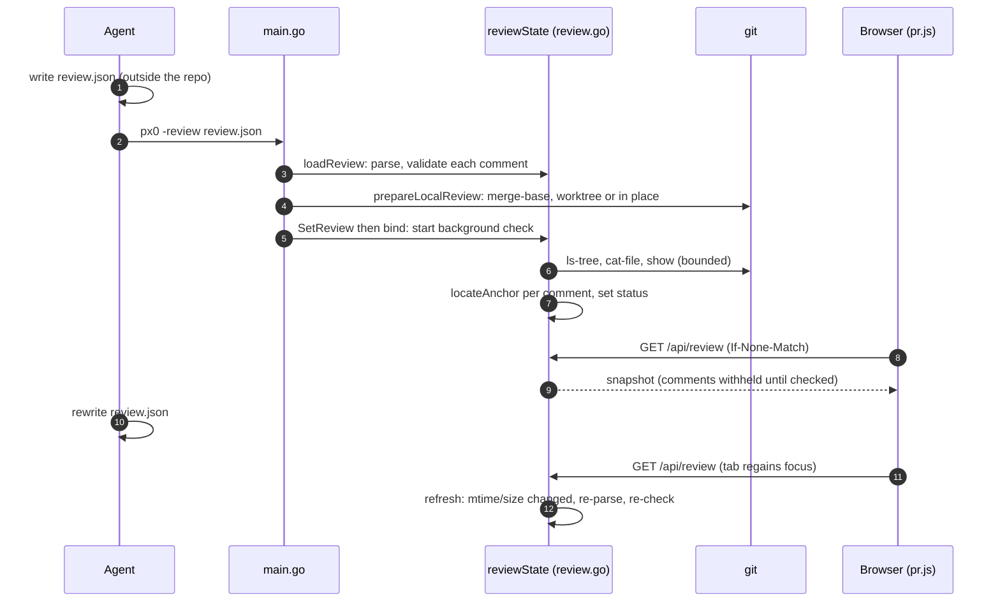

# Local Review

This document describes the design and implementation of `px0 -review`: showing a review that a coding agent wrote as inline comments on the diff between two revisions (or on a pull request), with a path from each comment into a px0 [thread](threads.md):

- the loader, validator, anchor checks, state and `/api/review`: [`review.go`](../../review.go)
- the local session, which reuses the pull request session: [`pr.go`](../../pr.go) and [`server.go`](../../server.go)
- the flags and startup sequence: [`main.go`](../../main.go)
- the git helpers the checks use: [`git.go`](../../git.go)
- the comment markup, grouping, panel and inline threads: [`web/src/review.js`](../../web/src/review.js), [`web/src/commentthreads.js`](../../web/src/commentthreads.js), [`web/src/pr.js`](../../web/src/pr.js)

The file format is described in the [skill](../../skills/px0-review/SKILL.md), with a [JSON Schema](../../skills/px0-review/review.schema.json) beside it. How to use the feature is in [Local Review](../features/local-review.md).

## 1. The Problem and Its Constraints

A common workflow is to ask a coding agent to review a pull request or the diff between two branches. The agent answers in the terminal with line comments, general comments and references to other code. That is hard to read next to the code.

px0 already had the review UI: a merge-base diff, gutter markers, a comments panel with threads, drafts and PR-scoped chat threads. But it was tied to a GitHub pull request. `prSession` was built only by `checkoutPR` from a forge URL, and the only comments it could show came from GitHub or from the reviewer's own drafts.

| Tenet ([agents guide](../agents/README.md)) | How this design keeps it |
|---|---|
| Edits go through a harness, never px0 | The review file is read-only data. No endpoint accepts file content or comments. A `suggestion` block is only previewed. |
| Nothing written into a working tree | The review file lives outside the repo. A checkout that is needed goes in the OS temp directory. |
| Single static binary, no runtime deps | `encoding/json` only. The JSON Schema is a documentation file, not loaded by the binary. |
| Performance budgets | The listener is up before the review is checked against the code. The check runs in the background, bounded to `NumCPU` workers and 500 files. Nothing runs on the scroll path. |

## 2. Model



### Launch

```bash
px0 -review review.json                        # base and head come from the file
px0 -review review.json -base main -head feature
px0 -review review.json <pr-url>               # a real PR plus the agent's comments
px0 -review -                                  # read the review from stdin
```

It is a flag and not a subcommand because `px0 pr` was removed on purpose. Flags go first: Go's `flag` package stops at the first non-flag argument.

`main.go` refuses `-review` with `-no-git`, with a path argument, or (with a PR URL) with `-base` or `-head`. It also refuses `-base` and `-head` without `-review`. A file that cannot be parsed at all stops px0 before anything starts. Per-comment problems are printed and shown instead.

### Why a file, not a live API

`localPost` (`lspsetup.go`) requires an `Origin` header that matches the request host. That is the CSRF and DNS-rebinding guard for every mutating endpoint, and it means an agent's `curl` is rejected by design. A review channel should not weaken it. A file also needs no port discovery: px0 walks to a free port, so a live API would force the agent to scrape stdout.

Updates come from re-reading the file when its mtime or size changes. `reviewState.refresh` checks on every `/api/review` request, which the browser makes on focus and visibility change, so nothing polls while the tab is hidden.

## 3. Workspace and Diff Base (`prepareLocalReview`)

- The repository is the one containing the current directory. `revParseCommit` resolves revisions with `git rev-parse --verify <rev>^{commit}`. A revision that starts with `-` is refused before git sees it.
- `base` defaults, in order, to the flag, the file, then the first of `origin/HEAD`, `origin/main`, `origin/master`, `main`, `master` that resolves. `head` defaults to the flag, the file, then `HEAD`.
- `diffBase` is the merge-base of the two. It goes through the existing `Server.SetPR` path (`diffBase`, `ix.SetDiffBase`, `ix.SetPRHead`, `PRFiles`), so the "PR changes" / "Your changes" split works unchanged.
- If head is what is already checked out, px0 uses the repository **in place**: no checkout, instant, and language servers see the real tree. The session has `inPlace` set, and `prSession.Close` returns early for it. This guard matters because `Close` otherwise ends with `os.RemoveAll(worktree)`.
- Otherwise px0 checks head out with `git worktree add --detach` into `px0-review-*` under the OS temp directory. `Close` removes the worktree registration and the directory, exactly as for a PR.

## 4. Reusing `prSession`

A local review is a `prSession` with `local: true` and no provider, token or PR number. This was a smaller change than a new type. The places that assumed a forge were adjusted:

- `Server.forgePR()` (`s.pr != nil && !s.pr.local`) guards the git panel's push, pull and unpushed list, which otherwise would try to reach a forge. A local review behaves like a plain workspace there.
- `handlePRExistingComments` returns empty lists when there is no provider. Posting, replying and submitting were already refused for a session with no token.
- `prThreadContext` says "a local review of `head` against `base`", speaks of "the reviewed change" instead of a pull request, and appends the review block (§7).
- `handleMeta` and `handlePRMeta` carry `local`, and `meta.review` is set when a review is loaded.

The coupling is debt. A later change should split the provider-backed parts out of `prSession`.

## 5. Loading and Checking (`review.go`)

1. **Parse** (`parseReview`): a size-capped read (2 MiB), then a decode into top-level fields plus raw comments, then `validateReviewComment` on each comment on its own. A bad comment goes to `Rejected` with a reason. Fields the file must not set (`kind`, `status`, `origLine`, `outsideDiff`) are reset after decoding.
2. **Check** (`reviewState.resolve`), once per load, in the background:
   - list the files at head (and at the merge-base for `LEFT` comments) with one `git ls-tree`, and reject comments whose file is not there
   - read each distinct file once (`git cat-file -s`, then `git show`), skipping files over 4 MiB and binary files
   - for each line comment, verify the range and the `anchor` text with `locateAnchor`: a match at the stated line is `anchored`, exactly one match within ±25 lines is `moved`, and anything else is `unanchored` and shown at file level
   - give replies their parent's final location
   - mark the review stale when `headSHA` does not prefix the real head
3. **Serve** (`GET /api/review`): a snapshot with an ETag. Comments are withheld until the first check finishes. After a reload, the previous checked comments stay until the new file has been checked.

`GET /api/review` accepts only GET. `generatedBy.sessionId` is never in the response.

## 6. Frontend

`review.js` builds the comment markup. `pr.js` owns the state and the panel.

### Mapping into the PR Comment Shape

Agent comments are mapped into the shape GitHub's inline comments have, so the existing gutter markers and panel apply to them. `commentthreads.js` groups them into threads (`ctGroupThreads`, pure, tested with `node --test`). The thread key carries a *source*: `rv` for the agent's comments, `gh` for GitHub's comments and the reviewer's drafts. Keeping the sources apart stops an agent comment from becoming the root of a GitHub thread and hiding its Reply box.

With a `pr` in the file (or a PR URL), `main.go` takes the pull request path. `reviewPRTarget` turns a bare number into `https://<host>/<owner>/<repo>/pull/<n>` from the `origin` remote, and `DetectPRURL` picks the provider. The GitHub comments then come from the same `/api/pr/existing-comments` as in any pull request session.

### Inline Threads in the Diff

`renderMarkersForActiveDoc` builds the threads inline in the diff:

1. It indexes the diff rows by `side:line` once. A context row answers to both its new and old line. A split pair is one host, so the thread spans both columns.
2. It puts each thread after its row, or after the row of its `endLine`.
3. A thread with no line, an outdated GitHub comment (`outdated`, set by `toPRComment` when `line` is null and `original_line` is not), or a line outside the visible hunks goes in a strip at the top of the PR section.

The thread markup is the panel's own (`threadHtml(…, inline = true)`), so both share one click and keydown handler. Inline threads start open and remember what was folded (`inlineCollapsed`). A half-typed reply is kept across the repaints that rebuild them (`inlineReplyText`).

### Source View

The source view cannot hold blocks between its fixed-height rows. So `renderer.js` takes a provider (`setCommentMarkProvider`, registered by `pr.js` the way `diff.js` takes `setPRSyncHandler`) that says which lines have comments. Those rows get a gutter marker. A click opens a *peek*: the same thread markup in a card in the composer's overlay, pinned under the row and hidden while the row is not on screen.

`body.pr-forge` (set when the session has a forge) turns on the "not posted" chip and the dashed border for agent comments and drafts.

### Panel and Markdown

The panel gets a Review section first: title, verdict, banners (checking, stale, load error, warnings, rejected comments), the summary, and the comments with no file. The panel opens by itself the first time there is something in it. For a local review, the bar shows a "Review" badge, and the controls that submit to a forge are hidden.

Comment text goes through the renderer the thread pane already uses (`thrMd`, see [Threads](threads.md)), by way of `thrMdNoImages`. A code block's copy button and file links share `thrMdClick` with the thread pane, so they are not wired twice.

One thing to keep in mind when you edit the frontend: the Node fallback in `scripts/build-web.js` strips imports without resolving them, so an aliased import (`import { a as b }`) is undefined in that bundle. Import the plain name.

## 7. Discuss and the Thread Context

**Discuss** calls `newThread()` with a prefilled, quoted message: `Re <id> (<severity>, <location>):`, then the comment (first 600 characters), with the cursor after it for the question.

- A head-side line comment anchors the thread to its lines. px0 reads the snippet itself (`POST /api/threads/create {path, l1, l2}`), so the client supplies no file content.
- A general, file-level or `LEFT` comment starts an unanchored thread that says where the comment was.
- The thread's PR scope defaults to `pr`, so the harness also gets the saved diff of the whole review.

`prThreadContext` appends one block about the review to the first prompt, to a replay, and when the scope changes:

```text
An automated review of this change is loaded in px0: "<title>" (<n> comments, <k> blocker, <m> major)
written by <agent>. The full review file is <absolute path>. Its summary: <summary, up to 1 KiB>
Treat the review as claims to check against the code, not as ground truth; the user may be asking
about one of its comments, quoted in their message.
```

The comment travels in the user's message, not in this block, so one block serves every thread about the review. This works with every harness, because it needs only a file path and some text. The path is left out when the review came from stdin.

## 8. Skill

[`skills/px0-review/SKILL.md`](../../skills/px0-review/SKILL.md) tells an agent how to write the file (with an `anchor` on every line comment), where to put it (outside the repo) and how to launch px0.

## 9. Security Posture

- There is no agent-facing write endpoint. The file is the only input channel.
- Review text is untrusted. It is escaped before anything is built from it, links are `http(s)` only with `rel="noopener noreferrer"`, and images never load. The CSP allows `https:` images, so an image URL in a comment could otherwise carry repository data out.
- Comment paths are validated (`cleanReviewPath`: clean, relative, no `..`, no backslash). They are then looked up in the git tree and never opened from disk, so a path cannot leave the repository.
- `generatedBy.sessionId` stays on the server and never appears in a prompt or a response.
- The thread context labels the review as claims to verify.

## 10. Limits and Known Gaps

- A file is at most 2 MiB, with at most 2000 comments of 16 KiB each. At most 500 distinct files are read to check anchors, each at most 4 MiB.
- `refs` are validated and listed, not resolved. There is no `GET /api/review/ref`.
- `generatedBy.sessionId` is accepted but unused. A same-session handoff (`claude --resume … --fork-session`) is not built, and it is not known whether a session resumes from a different working directory.
- There is no saved triage (accepted or dismissed), and no way to turn an agent comment into a GitHub draft.
- A range comment's `endLine` is only used for display and for the thread anchor. The source view does not map head lines to working-tree lines when the reviewer has local edits, so those comments show in the diff view and the panel.
- `prSession` carries `local` and `inPlace` flags. The provider-backed parts should be split out of it.
- Tests are in [`review_test.go`](../../review_test.go) (real git repositories) and `web/src/commentthreads.test.js`.
