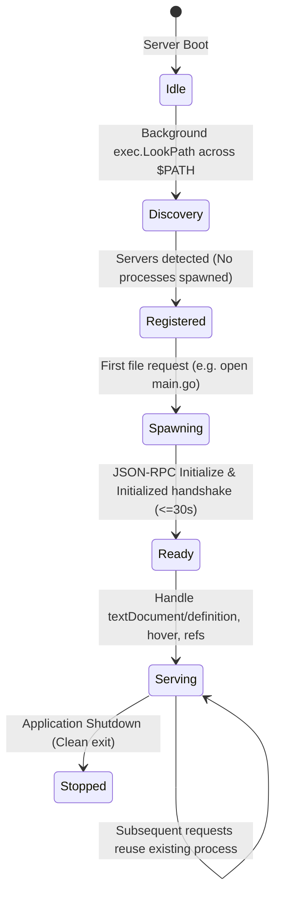
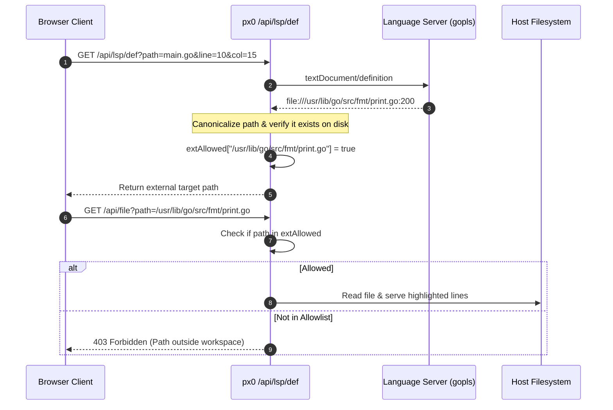

# Language Server Protocol (LSP) Architecture & Intelligence

This document details the architecture, lifecycle management, and security boundaries of px0's Language Server Protocol subsystem ([`lsp.go`](../../lsp.go), [`lspnav.go`](../../lspnav.go), [`lspservers.go`](../../lspservers.go), [`lspsetup.go`](../../lspsetup.go), and [`calls.go`](../../calls.go)).

## 1. Zero-Cost Lazy Architecture

Traditional IDEs start multiple language server processes during project initialization, consuming hundreds of megabytes of RAM before the developer opens a single file.

px0 adopts a strictly Zero-Cost Lazy Architecture:

### Key Principles

1. Zero Boot Overhead: During startup, px0 does not launch any language servers. It scans `$PATH` concurrently via `exec.LookPath` to identify which server binaries exist on the host system.
1. On-Demand Spawning: A language server process is launched only when the user opens or queries a file matching its registered file extensions.
1. Graceful Fallback: If a server is missing, crashes, or fails initialization, the system falls back to instant regex-based symbol definitions without displaying error dialogs.

## 2. Server Registry & Extension Precedence

Language server definitions reside in [`lspservers.go`](../../lspservers.go). Multiple language servers can be registered for a given extension, evaluated in order of precedence:

| Language          | Extensions                   | Primary Server               | Fallback Server | Discovery Search Paths     |
| ----------------- | ---------------------------- | ---------------------------- | --------------- | -------------------------- |
| Go                | `.go`                        | `gopls`                      | -               | `$PATH`, `~/go/bin`        |
| Rust              | `.rs`                        | `rust-analyzer`              | -               | `$PATH`, `~/.cargo/bin`    |
| TypeScript / JS   | `.ts`, `.tsx`, `.js`, `.jsx` | `typescript-language-server` | -               | `$PATH`, npm global prefix |
| Python            | `.py`                        | `pyright`                    | `pylsp`, `ruff` | `$PATH`, `~/.local/bin`    |
| C / C++           | `.c`, `.cpp`, `.h`, `.hpp`   | `clangd`                     | -               | `$PATH`, Homebrew LLVM     |
| Zig               | `.zig`                       | `zls`                        | -               | `$PATH`                    |
| Lua               | `.lua`                       | `lua-language-server`        | -               | `$PATH`                    |
| Ruby              | `.rb`                        | `solargraph`                 | -               | `$PATH`, Gem bin           |
| Java              | `.java`                      | `jdtls`                      | -               | `$PATH`                    |
| C#                | `.cs`                        | `omnisharp`                  | -               | `$PATH`                    |

## 3. Communication & Lifecycle Management

Each active language server is managed by an `lspClient` struct:

### Stdio JSON-RPC Transport

- Communication occurs via standard input/output (`os/exec.Cmd.StdinPipe` and `StdoutPipe`).
- Messages conform to the Language Server Protocol (Content-Length delimited JSON-RPC).
- Responses are correlated using atomic sequence IDs.

### Concurrency & Serialization

- Requests are serialized through thread-safe channels.
- Operations that exceed time budgets (e.g., hanging server queries) are bounded by contexts (`context.WithTimeout`).
- Server initialization enforces a strict 30-second timeout.

## 4. External Path Boundary Sandboxing (`extAllowed`)

When a developer navigates code using Go-to-Definition (`F12`), the target definition often resides outside the workspace directory (e.g., standard library packages in `/usr/lib/go/src` or third-party dependencies in `~/.cargo/registry`).

Allowing arbitrary filesystem reads would introduce path traversal vulnerabilities. px0 solves this with an In-Memory Target Allowlist:

- Target paths returned by the server are normalized and admitted into `extAllowed`.
- External files can be opened and inspected, but cannot be enumerated, searched, listed in the sidebar explorer tree, or edited with an agent.

## 5. Stateless Call Hierarchy Trails ([`calls.go`](../../calls.go))

px0 provides full incoming and outgoing call hierarchy navigation (`Calls` tab in the right inspector) without holding complex graph state in server memory.

### Opaque Item Round-Tripping

- The LSP specification identifies call hierarchy items with an implementation-specific `CallHierarchyItem` object.
- When expanding a function, the server sends this JSON object to the client browser.
- When the user clicks to expand a caller or callee, the browser sends the exact `CallHierarchyItem` back to `/api/lsp/calls`.
- Zero Server State: px0 maintains no in-memory graph trees; cost scales strictly with the nodes the user expands.
- Client-Side Cycle Detection: Recursive call loops are detected in JavaScript by checking ancestor node identifiers in the tree path.

## 6. In-App Setup & One-Click Installers

When reading a codebase without an installed language server, the status bar displays `LSP: set up`. Clicking it opens the interactive setup panel (`web/src/lspsetup.js`).

### Security Validation (DNS-Rebinding Defense)

Executing installation commands (e.g., `go install` or `npm install`) requires robust security precautions:

1. `/api/lsp/install` accepts only `POST` requests.
1. The `Origin` header must exactly match the `Host` header.
1. The `Host` header must resolve strictly to `127.0.0.1`, `[::1]`, or `localhost`.
1. Commands are pulled strictly from the internal `lspRegistry`, and the client request cannot provide or modify the command string.
