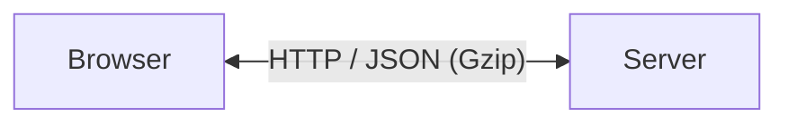

# Mermaid Diagrams in the Markdown Preview

px0 renders ```` ```mermaid ```` fences as diagrams. This document covers the lazy loader and the vendored library, the card the diagram is mounted in, and what happens when a diagram cannot be drawn.

Everything else about a Markdown tab — the server render, the sanitizer, source/preview switching, line anchors — is in [markdown.md](markdown.md).

---

## 1. Request Flow

```text
GET /api/markdown              goldmark keeps the fence as escaped source
        |
        v
mdSanitize() / mdEnhance()     the fence survives as <pre class="md-code" data-lang="mermaid">
        |
        v
renderMermaidBlocks()          swaps each fence for a diagram wrapper
        |
        |  import('/static/lib/mermaid/<version>/mermaid.esm.min.mjs')   once, lazily
        v
mermaid.render()               one diagram at a time, as it scrolls into view
        |
        v
mountDiagram()                 fitted inline card; a click opens the zoom card
```

Two modules split the work:

| File | Job |
| ---- | --- |
| `web/src/mermaid.js` | Detect fences, load Mermaid lazily, parse and render, fall back on failure, re-render on theme changes. |
| `web/src/mermaid-view.js` | Present a finished SVG: the inline card, the zoom card, wheel zoom and pan. It never talks to Mermaid. |

## 2. Lazy Loading and Vendoring

Mermaid is not part of `web/app.js`. The bundle carries only the loader; the library is imported with a computed URL the bundler cannot follow:

```js
const MERMAID_URL = '/static/lib/mermaid/' + MERMAID_VERSION + '/mermaid.esm.min.mjs';
mermaidPromise = import(MERMAID_URL);
```

The import happens only when a preview actually contains `pre[data-lang="mermaid"]`, so a document without diagrams downloads no Mermaid bytes. The vendored tree is immutable (`scripts/vendor-mermaid.sh` pins a sha256-verified npm tarball), which lets `ServeHTTP` answer `/static/lib/` with `Cache-Control: public, max-age=31536000, immutable` while every other response stays `no-store`. One browser fetches the multi-megabyte library once, across sessions.

Diagrams draw as soon as the preview is shown, one at a time through a shared queue, so opening a file draws every diagram without scrolling. A preview is capped at 50 diagrams and 2,000 source characters per diagram; beyond that the fence stays as source with a note. Rendering runs under Mermaid's `strict` security level.

The theme config is rebuilt from the computed CSS tokens documented in `STYLING.md` and re-applied when `html[data-theme]` changes, so diagrams follow every theme.

Labels wrap inside their nodes. Mermaid starts a label as `white-space: nowrap; display: table-cell; max-width: <wrappingWidth>` and only switches to the wrapping layout when the measured width is *exactly* `wrappingWidth`; engines that ignore `max-width` on table-cell (Firefox) keep `nowrap` and clip the tail of a long label. px0 ships a `themeCSS` rule (`display: table`, `white-space: break-spaces`, the same max-width, `overflow-wrap: anywhere`) that is embedded in the SVG and applied during measurement as well, so the node is sized for wrapped text and a label can never be cut off. Unbroken identifiers wrap too instead of stretching their node. Subgraph titles are excluded from that rule — Mermaid sizes them to their content deliberately — and get spacing around them from `flowchart.subGraphTitleMargin` (8px above, 16px below).

Sequence diagrams get `sequence.wrap: true`, so a long message wraps inside the gap between its lifelines instead of stretching the diagram past the card. Other text-based diagram types (gantt, timeline, pie) have no wrapping knob in Mermaid; they rely on the card's fit and the zoom card.

## 3. The Cards

The inline card fits the whole diagram into the preview column (never above 100%). Its height may grow to 80% of the window, up to 720px, so a tall diagram stays readable instead of being squeezed into a fixed box; only past that cap does the fit scale it down. It refits when the column is resized (window or sidebar); zooming cannot change the layout around it.

Clicking the diagram — or the button in its header — opens the zoom card, a modal with a fixed viewport:

- `−` and `+` step the scale by 1.25, clamped to 25%–400%.
- The percentage resets to fit and re-centres the diagram.
- The wheel zooms anchored at the cursor: the point under the pointer stays under the pointer.
- Dragging pans the stage itself, so it works at every zoom level — including a diagram that already fits the viewport. A pan can push the diagram mostly off-view but never fully out of it.
- Escape, the close button, or a click on the backdrop dismisses it.

## 4. When a Diagram Cannot Be Drawn

A diagram that fails to import, parse or render must never blank the document. The original fenced source is put back and a short note appears under it:

```text
Mermaid (line 30): Parse error on line 21: ...er <-->|HTTP / JSON (Gzip)| Server
```

The line number is the fence's own line in the Markdown file, not Mermaid's internal line. px0 does not rewrite diagram source: repos contain diagrams written for other Mermaid versions, and silently "fixing" one could change what it says. The source block itself is the escape hatch — it can be copied into any Mermaid-capable editor.

## 5. Authoring Diagrams

Quote edge labels that contain punctuation. Mermaid's parser rejects an unquoted label with `/`, `(` or `)`:



An unquoted `|HTTP / JSON (Gzip)|` fails with `Parse error ... got 'PS'`. This is a fence syntax problem, not a px0 problem; fixing the document fixes the preview.

To check a repository's diagrams against the exact version px0 ships, run the vendored parser over every Mermaid fence. With Node and `jsdom` available:

```sh
node scripts/check-mermaid.mjs
```

The script extracts fences from tracked Markdown files and reports the first parse error per diagram, which is what the preview would show.
