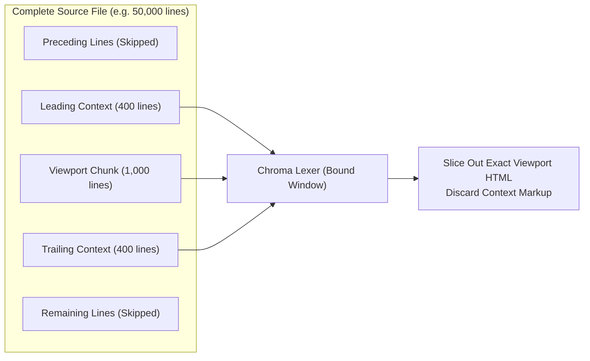
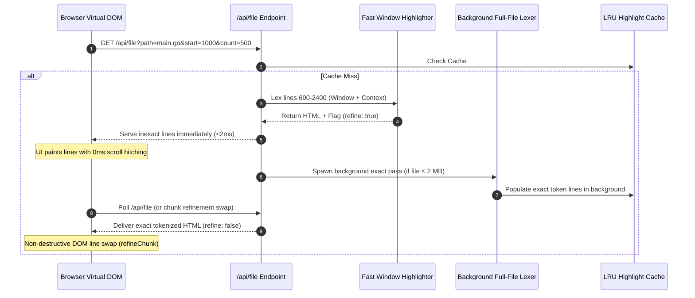

# Windowed Syntax Highlighting Engine

This document details the architecture and performance strategies of px0's windowed syntax highlighting engine ([`highlight.go`](../../highlight.go)).

## 1. The Syntax Highlighting Bottleneck

px0 utilizes [Chroma](https://github.com/alecthomas/chroma) (a pure Go syntax highlighter modeled after Pygments) to tokenize ~280 programming languages without external dependencies or CGO.

However, full-AST lexical analysis is computationally intensive:

- Chroma lexers typically process source text at roughly 500 KB to 1.5 MB per second.
- Highlighting a 100,000-line file (several megabytes of code) upfront would introduce a 3-to-8 second freeze before displaying the first line.
- Naive lexing of an entire file requires holding millions of syntax token structs on the heap.

To deliver instantaneous file opening (under 5 milliseconds), px0 implements Viewport-Based Windowed Highlighting with Dual-Tier Background Refinement.

## 2. Windowed Highlighting Architecture

Rather than tokenizing the entire file, px0 tokenizes only the slice of lines needed by the user's current scroll viewport, padded with leading and trailing context:



### Highlighting Parameters

- `hlChunk = 1000`: Number of active lines tokenized for the current request.
- `hlContext = 400`: Number of preceding lines fed into the lexer.
  - Leading Context Purpose: Resets the lexer into the correct multi-line state (e.g., inside a multi-line docstring, backtick template literal, or block comment).
  - Trailing Context Purpose: Ensures open tokens are properly closed without trailing syntax anomalies.
- `hlWindowBytes = 512 KB`: Maximum byte size for any tokenization window.

### Byte-Cap Protection (`hlWindowBytes`)

In minified JavaScript or massive one-line JSON documents, 1,000 lines could equal 20+ megabytes of text. If a window slice exceeds `512 KB`, context lines are automatically dropped to prevent CPU hangs.

## 3. Dual-Tier Refinement Architecture

While 400 lines of context correctly identifies >99.5% of syntax states, extreme cases exist where a raw string literal or comment block opens 2,000 lines earlier.

px0 handles this with a Dual-Tier Processing Strategy:



1. Tier 1 (Instant Viewport Pass): Evaluates the bounded window (`start - hlContext` to `start + count + hlContext`). Slices out and returns the target lines in 1-2 ms. If the window contains potential multi-line ambiguities, the payload includes `refine: true`.
1. Tier 2 (Background Exact Pass): If the file is under `bgLimit = 2 MB`, a background goroutine performs an exact full-file tokenization pass. The exact result is stored in the LRU cache. The frontend's `refineChunk()` updates the rendered rows in-place without disturbing the user's scroll position or selection.

## 4. Short-Class CSS Tokenization

Chroma's default HTML formatter outputs lengthy inline CSS or verbose class names (e.g. `<span class="chroma-keyword-declaration">func</span>`), which bloats the DOM and increases network payload size.

px0 maps token types to minimal 1-to-2 character CSS classes:

| Class  | Chroma Token Type    | Semantic Role                                 |
| ------ | -------------------- | --------------------------------------------- |
| `.k`   | `Keyword`            | Language keywords (`func`, `return`, `class`) |
| `.nf`  | `NameFunction`       | Function declarations and calls               |
| `.s`   | `LiteralString`      | String literals                               |
| `.m`   | `LiteralNumber`      | Numeric constants                             |
| `.c`   | `Comment`            | Single and multi-line comments                |
| `.kd`  | `KeywordDeclaration` | Type declarations                             |
| `.kt`  | `KeywordType`        | Primitive types (`int`, `string`, `bool`)     |
| `.err` | `Error`              | Syntax errors                                 |

This keeps network payloads minimal and guarantees that CSS stylesheets define colors cleanly through CSS custom properties (`--k`, `--nf`, `--s`, `--c`).

The diff endpoint uses the same lexer and compact token classes. It tokenizes
the old and new sides of each hunk separately, preserving lexer state across
the context shown in that hunk, and returns safe HTML in arrays parallel to the
raw diff lines. The browser keeps parsing the raw unified diff for layout and
uses the parallel markup only when painting code cells, so split and unified
views share identical highlighting without a client-side language runtime.
The combined raw payload is budgeted before any hunk splitting or lexing. It
defaults to 512 KiB across all variants in one response (including PR and local
change sections); larger diffs omit token arrays entirely and render as escaped
plain text. `diffEditor.maxTokenizationSizeKB` configures the limit, with `0`
disabling diff tokenization.

## 5. Byte-Budgeted LRU Memory Cache

Generated HTML fragments are cached in memory using a Least Recently Used (LRU) eviction policy backed by Go's `container/list`.

```go
const cacheBudget = 512 * 1024 * 1024 // 512 MB memory budget
```

- Every cached line entry tracks its raw string byte footprint.
- When total cached line data exceeds `cacheBudget`, oldest entries are evicted from the tail of the LRU list until memory drops below the threshold.
- Switching between tabs and scrolling backward reuses cached HTML strings instantly without hitting Chroma.
