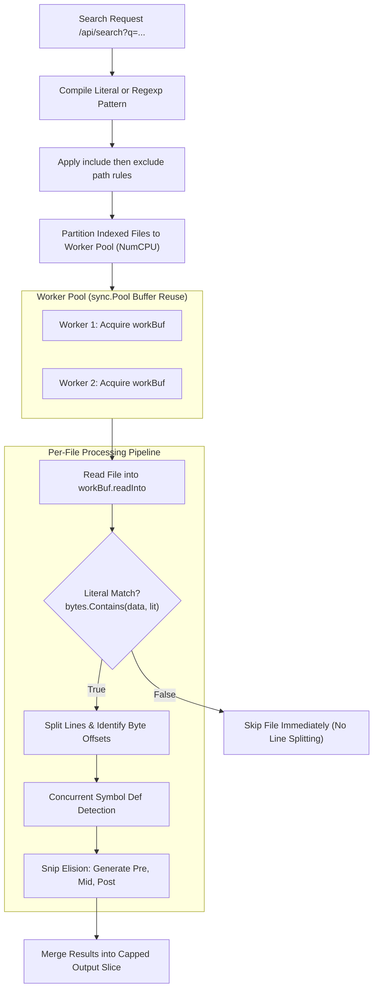

# Workspace Search & Symbol Extraction

This document explains px0's high-throughput parallel search engine ([`search.go`](../../search.go)) and fast regex symbol extractor ([`symbols.go`](../../symbols.go)).

## 1. Search Engine Architecture

Full-text search in px0 is built to scan hundreds of megabytes of source code in milliseconds without spawning external processes (like `grep` or `ripgrep`) and without thrashing the Go heap.



## 2. Memory Optimization: `workBuf` Pooling

Before workers read file contents, the searcher applies the optional include rule and every comma- or newline-separated exclude rule using the same compiled path matcher as workspace ignores. Include narrows the indexed candidate set; exclude removes exact paths, directory globs, and filename globs from it. This ordering prevents excluded files from consuming disk I/O or worker buffers.

Reading thousands of files off disk can overwhelm Go's memory allocator if buffers are created per file. px0 eliminates per-file allocations using a `sync.Pool` of reusable worker buffers:

```go
type workBuf struct {
    readInto   []byte // Reusable disk read buffer
    asciiLower []byte // In-place ASCII lowercase buffer
}

var workPool = sync.Pool{
    New: func() any {
        return &workBuf{
            readInto:   make([]byte, 0, 64*1024),
            asciiLower: make([]byte, 0, 64*1024),
        }
    },
}
```

### In-Place ASCII Lowercasing

For case-insensitive literal searches, converting full UTF-8 strings with `strings.ToLower()` allocates new heap memory for every line. Instead, `search.go` performs in-place byte lowercasing directly into `workBuf.asciiLower`:

- ASCII characters A-Z are mapped to a-z via single-byte manipulation (`b + 32`).
- UTF-8 multibyte characters are preserved untouched.
- Literal matching executes via SIMD-accelerated `bytes.Contains()` and `bytes.Index()` with zero heap allocations.

## 3. Fast Rejection Fast Path

The vast majority of files in any repository do not contain the search term. Splitting file contents into lines and iterating line-by-line is expensive.

px0 applies an instant rejection test before doing any line parsing:

```go
if !isRegex && !caseSensitive {
    if !bytes.Contains(lowerData, queryLower) {
        return // Term does not exist anywhere in file: skip immediately
    }
}
```

If `bytes.Contains()` returns `false`, the entire file is discarded in a few microseconds without examining a single newline.

## 4. Structured Snippet Elision (`{Pre, Mid, Post}`)

Long source lines (such as minified code, long strings, or complex expressions) cannot be displayed in full inside a compact sidebar search panel. 

Instead of returning raw byte offsets or forcing the JavaScript client to calculate UTF-16 string offsets, `search.go` performs line elision server-side:

```go
type Match struct {
    Line int    `json:"line"` // 1-based line number
    Pre  string `json:"pre"`  // Text before the match
    Mid  string `json:"mid"`  // Matched query text
    Post string `json:"post"` // Text after the match
    Def  bool   `json:"def,omitempty"` // True if line declares a symbol
}
```

### Snippet Constants

- `snipLead = 32`: Match offset threshold before leading text is elided.
- `snipKeep = 16`: Number of leading runes retained when truncating (e.g., `...getComponent()`).
- `snipMax = 240`: Maximum total rune budget for the entire rendered snippet.

### Why Structured Slices?

1. Zero Client Discrepancies: JavaScript uses UTF-16 code units, whereas Go uses UTF-8 byte sequences. Sending offsets requires complex client-side reconciliation. Sending pre-split strings completely eliminates boundary alignment bugs.
1. Bandwidth Savings: Discarding massive leading and trailing line segments shrinks JSON payloads significantly.

## 5. Regex Symbol Extraction ([`symbols.go`](../../symbols.go))

When language servers are disabled or unavailable, px0 provides instantaneous symbol outlines and declaration jump navigation via heuristic regular expressions.

### Parallel Symbol Flagging

During full-text searches, lines that look like function, class, struct, or type declarations are automatically flagged (`Match.Def = true`). This allows the frontend to visually highlight definition matches in search results without running a secondary query.

### Supported Language Grammars

`symbols.go` maintains high-performance compiled regular expressions for:

- Go: `func (r *Receiver) Name(...)`, `type Name struct/interface`
- TypeScript / JavaScript: `function name()`, `class Name`, `const name = () =>`, `interface Name`
- Python: `def name(...)`, `class Name(...)`
- Rust: `fn name(...)`, `struct Name`, `enum Name`, `trait Name`, `impl Name`
- C / C++: Return types, class declarations, structs, functions
- Java / C# / PHP / Ruby: Methods, properties, classes, modules
